# ___2017 - 05 - 30 机器学习 (监督学习 分类 / 回归)___
***

# 目录
  <!-- TOC depthFrom:1 depthTo:6 withLinks:1 updateOnSave:1 orderedList:0 -->

  - [___2017 - 05 - 30 机器学习 (监督学习 分类 / 回归)___](#2017-05-30-机器学习-监督学习-分类-回归)
  - [目录](#目录)
  - [机器学习基础概念](#机器学习基础概念)
  	- [关键术语](#关键术语)
  	- [监督学习算法 - 分类和回归](#监督学习算法-分类和回归)
  	- [非监督学习算法 - 聚类和密度估计](#非监督学习算法-聚类和密度估计)
  	- [开发机器学习应用程序的步骤](#开发机器学习应用程序的步骤)
  	- [原数据链接](#原数据链接)
  - [k-近邻算法 kNN](#k-近邻算法-knn)
  	- [介绍](#介绍)
  	- [python实现kNN分类算法](#python实现knn分类算法)
  	- [k近邻算法改进约会网站的配对效果](#k近邻算法改进约会网站的配对效果)
  	- [使用k-近邻算法的手写识别系统](#使用k-近邻算法的手写识别系统)
  - [决策树 Decision trees](#决策树-decision-trees)
  	- [介绍](#介绍)
  	- [决策树的构造](#决策树的构造)
  	- [信息增益](#信息增益)
  	- [python计算信息熵](#python计算信息熵)
  	- [python选择熵最低的特征值划分方式](#python选择熵最低的特征值划分方式)
  	- [python递归构建决策树](#python递归构建决策树)
  	- [使用决策树预测隐形眼镜类型](#使用决策树预测隐形眼镜类型)
  	- [scikit库中的决策树使用](#scikit库中的决策树使用)
  - [基于概率论的分类方法：朴素贝叶斯 Naive Bayes](#基于概率论的分类方法朴素贝叶斯-naive-bayes)
  	- [介绍](#介绍)
  	- [朴素贝叶斯分类器中的假设](#朴素贝叶斯分类器中的假设)
  	- [简单测试用数据集](#简单测试用数据集)
  	- [python实现的数据训练 / 测试算法](#python实现的数据训练-测试算法)
  	- [使用朴素贝叶斯过滤垃圾邮件](#使用朴素贝叶斯过滤垃圾邮件)
  - [基于Logistic回归和Sigmoid函数的分类](#基于logistic回归和sigmoid函数的分类)
  	- [介绍](#介绍)
  	- [单位阶跃函数 / Sigmoid函数](#单位阶跃函数-sigmoid函数)
  	- [Logistic分类器回归系数](#logistic分类器回归系数)
  	- [梯度上升的最优化方法确定最佳回归系数](#梯度上升的最优化方法确定最佳回归系数)
  	- [两个数值型特征的简单测试数据集](#两个数值型特征的简单测试数据集)
  	- [python实现 梯度上升 算法与绘制最佳拟合直线](#python实现-梯度上升-算法与绘制最佳拟合直线)
  	- [python实现 随机梯度上升 算法](#python实现-随机梯度上升-算法)
  	- [参数收敛](#参数收敛)
  	- [python实现 改进的随机梯度上升 算法](#python实现-改进的随机梯度上升-算法)
  	- [从疝气病症预测病马的死亡率](#从疝气病症预测病马的死亡率)
  - [支持向量机 Support Vector Machine(SVM)](#支持向量机-support-vector-machinesvm)
  	- [介绍](#介绍)
  	- [数学基础](#数学基础)
  	- [寻找最大间隔](#寻找最大间隔)
  	- [简化版SMO高效优化算法](#简化版smo高效优化算法)
  	- [python实现简化版SMO函数](#python实现简化版smo函数)
  	- [> 利用完整Platt SMO算法加速优化](#-利用完整platt-smo算法加速优化)
  	- [> 在复杂数据上应用核函数](#-在复杂数据上应用核函数)
  	- [> python实现的核转换函数](#-python实现的核转换函数)
  	- [> 利用核函数进行分类的径向基测试函数](#-利用核函数进行分类的径向基测试函数)
  - [利用AdaBoost元算法提高分类性能 adaptive boosting](#利用adaboost元算法提高分类性能-adaptive-boosting)
  	- [介绍](#介绍)
  	- [bagging / boosting](#bagging-boosting)
  	- [AdaBoost运行过程](#adaboost运行过程)
  	- [python实现基于单层决策树 decision stump 构建弱分类器](#python实现基于单层决策树-decision-stump-构建弱分类器)
  	- [python实现完整AdaBoost算法](#python实现完整adaboost算法)
  	- [在一个难数据集上应用AdaBoost](#在一个难数据集上应用adaboost)
  	- [过拟合 overfitting](#过拟合-overfitting)
  - [ROC曲线 / AUC性能值 / 非均衡分类问题](#roc曲线-auc性能值-非均衡分类问题)
  	- [混淆矩阵 confusion matrix](#混淆矩阵-confusion-matrix)
  	- [ROC 曲线](#roc-曲线)
  	- [AUC 性能值](#auc-性能值)
  	- [ROC曲线绘制](#roc曲线绘制)
  	- [python实现ROC曲线的绘制及AUC计算](#python实现roc曲线的绘制及auc计算)
  	- [基于代价函数的分类器决策控制](#基于代价函数的分类器决策控制)
  	- [处理非均衡问题的数据抽样方法](#处理非均衡问题的数据抽样方法)
  - [线性回归预测数值型数据](#线性回归预测数值型数据)
  	- [普通最小二乘法线性回归 ordinary least squares, OLS](#普通最小二乘法线性回归-ordinary-least-squares-ols)
  	- [python实现普通最小二乘法线性回归](#python实现普通最小二乘法线性回归)
  	- [相关系数计算预测值和真实值的匹配程度](#相关系数计算预测值和真实值的匹配程度)
  	- [局部加权线性回归 Locally Weighted Linear Regression，LWLR](#局部加权线性回归-locally-weighted-linear-regressionlwlr)
  	- [python实现局部加权线性回归函数](#python实现局部加权线性回归函数)
  	- [预测鲍鱼的年龄](#预测鲍鱼的年龄)
  	- [缩减系数来理解数据，岭回归 ridge regression](#缩减系数来理解数据岭回归-ridge-regression)
  	- [python实现岭回归预测](#python实现岭回归预测)
  	- [lasso 缩减](#lasso-缩减)
  	- [前向逐步回归](#前向逐步回归)
  	- [python实现前向逐步线性回归](#python实现前向逐步线性回归)
  	- [权衡偏差与方差](#权衡偏差与方差)
  - [树回归](#树回归)
  	- [复杂数据的局部性建模 CART](#复杂数据的局部性建模-cart)
  	- [python实现回归树 regression tree](#python实现回归树-regression-tree)
  	- [python自定义树的一些相关方法](#python自定义树的一些相关方法)
  	- [树剪枝 tree pruning](#树剪枝-tree-pruning)
  	- [python实现回归树后剪枝 postpruning](#python实现回归树后剪枝-postpruning)
  	- [python实现模型树 model tree](#python实现模型树-model-tree)
  	- [python进行 树回归 与 标准回归 的预测结果比较](#python进行-树回归-与-标准回归-的预测结果比较)

  <!-- /TOC -->
***

# 机器学习基础概念
## 关键术语
  - **算法训练**：为算法输入大量已分类数据作为算法的训练集,学习如何分类
  - **目标变量**：机器学习算法的预测结果，在分类算法中目标变量的类型通常是离散型的，而在回归算法中通常是连续型的，训练样本集必须确定知道目标变量的值，以便机器学习算法可以发现特征和目标变量之间的关系
  - **训练数据和测试数据**
    - 为了测试机器学习算法的效果，通常使用两套独立的样本集，当机器学习程序开始运行时，使用训练样本集作为算法的输入，训练完成之后输入测试样本
    - 输入测试样本时并不提供测试样本的目标变量，由程序决定样本属于哪个类别
    - 比较测试样本预测的目标变量值与实际样本类别之间的差别，就可以得出算法的实际精确度
  - **知识表示**
    - 某些算法可以产生很容易理解的知识表示，而某些算法的知识表示也许只能为计算机所理解
    - 知识表示可以采用规则集的形式，也可以采用概率分布的形式，甚至可以是训练样本集中的一个实例
    - 在某些场合中，可能并不想建立一个专家系统，而仅仅对机器学习算法获取的信息感兴趣
  - **特征向量 feature / 观测值 observations**
    - 在二维数据中，每一列数据为一个特征向量，每一行数据对应一组观测值
    ```python
    # feature: f0    f1    f2
    obss = [[  1.,   1.,   1.],  #o0
            [  2.,   2.,   2.],  #o1
            [  3.,   3.,   3.],  #o2
            [  4.,   4.,   4.]]  #o3
    ```
## 监督学习算法 - 分类和回归
  - 这类算法通常知道目标变量的分类信息，在该基础上预测未知变量的类型
  - **分类算法**，主要任务是将实例数据划分到合适的分类中，目标变量是离散型，如是/否、1/2/3、A/B/C或者红/黄/黑等
    ```
    k-近邻算法 / 朴素贝叶斯算法 / 支持向量机 / 决策树
    ```
  - **回归算法**，主要用于预测连续型数值数据，如0.0～100.00、-999～999或者+∞～-∞等
    ```
    线性回归 / 局部加权线性回归 / Ridge 回归 / Lasso 最小回归系数估计
    ```
## 非监督学习算法 - 聚类和密度估计
  - 与监督学习相对应的是，此时数据没有类别信息，也不会给定目标值，分析是否需要将数据划分为离散的组
  - **聚类算法**，将数据集合分成由类似的对象组成的多个离散组
    ```
    K-均值 / DBSCAN
    ```
  - **密度估计算法**，寻找描述数据统计值，进一步估计数据与每个分组的相似程度
    ```
    最大期望算法 / Parzen窗设计
    ```
  - 非监督学习还可以减少数据特征的维度，以便可以使用二维或三维图形更加直观地展示数据信息
## 开发机器学习应用程序的步骤
  - 机器学习算法虽然各不相同，但是使用算法创建应用程序的步骤却基本类似
    ```
    数据收集 --> 数据整理 --> 数据分析 --> 训练算法 --> 测试算法 --> 使用算法
    ```
  - **了解数据**，对实际数据了解得越充分，越容易创建符合实际需求的应用程序，缩短选择机器学习算法的时间
    - 特征值是离散型变量还是连续型变量
    - 特征值中是否存在缺失的值，何种原因造成缺失值
    - 数据中是否存在异常值
    - 某个特征发生的频率如何（是否罕见得如同海底捞针）
  - **反复试错的迭代过程**，只能在一定程度上缩小算法的选择范围，一般并不存在最好的算法或者可以给出最好结果的算法
    - 同时尝试不同算法的执行效果
    - 对于所选的每种算法，都可以使用其他的机器学习技术来改进其性能
    - 在处理输入数据之后，两个算法的相对性能也可能会发生变化
    - 一般说来发现最好算法的关键环节是反复试错的迭代过程
## 原数据链接
  - [Machine Learning in Action](www.manning.com/MachineLearninginAction)

  - [Source Code & Data](https://manning-content.s3.amazonaws.com/download/3/29c6e49-7df6-4909-ad1d-18640b3c8aa9/MLiA_SourceCode.zip)
***

# k-近邻算法 kNN
## 介绍
  - 简单地说，k近邻算法采用测量不同特征值之间距离的方法进行分类
  - **优点**：精度高、对异常值不敏感、无数据输入假定
  - **适用数据范围**：数值型和标称型
  - **缺点**：计算复杂度高、空间复杂度高
    - k近邻算法是基于实例的学习，使用算法时我们必须有接近实际数据的训练样本数据
    - k近邻算法必须保存全部数据集，如果训练数据集的很大，必须使用大量的存储空间
    - 由于必须对数据集中的每个数据计算距离值，实际使用时可能非常耗时
    - K近邻算法的另一个缺陷是它无法给出任何数据的基础结构信息，因此我们也无法知晓平均实例样本和典型实例样本具有什么特征
  - **工作原理**
    - 存在一个样本数据集合，也称作 **训练样本集**，并且样本集中每个数据都存在标签，即我们知道样本集中每一数据与所属分类的对应关系
    - 输入没有标签的 **新数据** 后，将新数据的每个特征与样本集中数据对应的特征进行比较，然后算法提取样本集中特征最相似数据（最近邻）的分类标签
    - 一般来说，我们只 **选择样本数据集中前k个最相似的数据**，这就是k-近邻算法中k的出处，通常k是不大于20的整数
    - 最后，选择k个最相似数据中 **出现次数最多的分类**，作为新数据的分类
  - **计算流程**
    - 计算已知类别数据集中的点与当前点之间的距离
    - 按照距离递增次序排序
    - 选取与当前点距离最小的k个点
    - 确定前k个点所在类别的出现频率
    - 返回前k个点出现频率最高的类别作为当前点的预测分类
  - **错误率**
    - 通过计算分类器给出错误结果的次数除以测试执行的总数
    - 错误率是常用的评估方法，主要用于 **评估分类器在某个数据集上的执行效果**
    - 通常我们只提供已有数据的90%作为训练样本来训练分类器，而使用其余的10%数据去测试分类器，检测分类器的正确率
## python实现kNN分类算法
  ``` python
  import pandas as pd
  import numpy as np

  # KNN算法
  def classify0(test, dataSet, labels, k):
     ''' 参数： 待分类数据, 已知数据 array, 已知数据标签 array, 选取的k值 '''
     # 使用欧氏距离公式 d = ( (A0 - B0)^2 + (A1 - B1)^2 )^0.5
     diffMat = (((dataSet - test) ** 2).sum(1)) ** 0.5

     # 取排序后的前k个值对应的标签，并根据索引计数
     # dms = pd.Series(pd.Series(diffMat).values, index = labels)
     # classCount = dms.sort_values().head(k).groupby(level=0).count()
     topclasses = labels[diffMat.argsort()[:k]]
     classCount = pd.value_counts(topclasses)

     # 返回排序后值最大的索引
     return classCount.idxmax()

  ```
  运行结果
  ``` python
  group = np.array([[1.0, 1.1], [1.0, 1.0], [0, 0], [0, 0.1]])
  labels = np.array(['A','A','B','B'])

  classify0([0,0], group, labels, 3)

  Out[5]: 'B'
  ```
## k近邻算法改进约会网站的配对效果
  ``` python
  def datingClassTest(hoRatio = 0.1, k = 5):
     ''' 参数：指定测试用例所占比例, 指定k值 '''
     # 读取数据集
     dating_columns = ['Flight_per_year', 'Video_game_rate', 'Ice_cream_per_week', 'Category']
     df = pd.read_table('machinelearninginaction/Ch02/datingTestSet2.txt', names=dating_columns)
     datingData = df[dating_columns[:-1]].values
     category = df[dating_columns[-1]].values

     # 数据规范化，将取值范围处理成[0, 1]
     data_min = datingData.min(0)
     data_range = datingData.max(0) - data_min
     datingData_norm = (datingData - data_min) / (data_range)

     # 计算测试数据量大小，以及错误统计
     test_volume = int(datingData_norm.shape[0] * hoRatio)
     error_count = 0

     # 训练数据
     x = datingData_norm[test_volume:]
     y = category[test_volume:]

     # 测试数据
     for i in range(test_volume):
         rc = classify0(datingData_norm[i], x, y, k)
         if (rc != category[i]):
             error_count += 1
             print('Not right! classified result = %d, real result = %d' %(rc, category[i]))
     print('total errors = %d, error rate = %f%%' %(error_count, error_count / float(test_volume ) *   100))

  ```
  运行结果
  ``` python
  datingClassTest()
  Not right! classified result = 3, real result = 2
  Not right! classified result = 2, real result = 3
  Not right! classified result = 3, real result = 1
  Not right! classified result = 2, real result = 3
  Not right! classified result = 2, real result = 1
  total errors = 5, error rate = 5.000000%
  ```
## 使用k-近邻算法的手写识别系统
  ``` python
  from os import listdir

  def img2vector(filename):
      ''' 读取转换为文本格式的图片文件 '''
      fr = open(filename, 'r')
      line = []
      for l in fr:
          line.append(list(l.strip()))
      arr = np.array(line).ravel()
      return [int(x) for x in arr]

  def handwritingClassTest(k = 3):
      ''' 参数：指定k值 '''
      # 训练集
      traing_path = 'machinelearninginaction/Ch02/trainingDigits/'
      training_file_list = listdir(
      traing_path)
      m = len(training_file_list)
      trainMat = np.zeros((m, 1024))
      hwlabels = []

      # 文件名格式类似 0_0.txt，第一个数字表示正确的数值
      for i in range(m):
          name = training_file_list[i]
          classNumStr = int(name.split('_')[0])
          hwlabels.append(classNumStr)
          trainMat[i] = img2vector(traing_path + '/' + name)
      hwlabels = np.array(hwlabels)

      # 测试集
      test_path = 'machinelearninginaction/Ch02/testDigits/'
      test_file_list = listdir(test_path)

      errorCount = 0.0
      m_test = len(test_file_list)
      for i in range(m_test):
          name = test_file_list[i]
          real_result = int(name.strip('_')[0])
          test_arr = img2vector(test_path + '/' + name)
          rc = classify0(test_arr, trainMat, hwlabels, k)
          if (rc != real_result):
              print('Wrong guess! file name = %s, real_result = %d, rc = %d' %(name, real_result, rc))
              errorCount += 1

      print('error counts = %d, error rates = %f%%' %(errorCount, errorCount / m_test * 100))
  ```
  运行结果
  ``` python
  handwritingClassTest()
  Wrong guess! file name = 3_11.txt, real_result = 3, rc = 9
  Wrong guess! file name = 1_86.txt, real_result = 1, rc = 7
  Wrong guess! file name = 5_42.txt, real_result = 5, rc = 3
  Wrong guess! file name = 5_43.txt, real_result = 5, rc = 6
  Wrong guess! file name = 8_11.txt, real_result = 8, rc = 6
  Wrong guess! file name = 8_23.txt, real_result = 8, rc = 3
  Wrong guess! file name = 8_36.txt, real_result = 8, rc = 1
  Wrong guess! file name = 8_45.txt, real_result = 8, rc = 1
  Wrong guess! file name = 9_14.txt, real_result = 9, rc = 1
  Wrong guess! file name = 9_60.txt, real_result = 9, rc = 7
  error counts = 10, error rates = 1.057082%
  ```
***

# 决策树 Decision trees
## 介绍
  - k-近邻算法可以很好地完成分类任务，但是它最大的缺点就是无法给出数据的内在含义，决策树的主要优势就在于数据形式非常容易理解
  - 决策树算法能够读取数据集合，构建类似于流程图的决策树
  - 决策树的一个重要任务是为了数据中所蕴含的知识信息，因此决策树可以使用不熟悉的数据集合，并从中提取出一系列规则，在这些机器根据数据创建规则时，就是机器学习的过程
  - **优点**：计算复杂度不高，输出结果易于理解，对中间值的缺失不敏感，可以处理不相关特征数据
  - **缺点**：可能会产生过度匹配问题
  - **适用数据类型**：数值型和标称型
## 决策树的构造
  - 需要解决的第一个问题就是，当前数据集上哪个特征在划分数据分类时起决定性作用，为了找到决定性的特征，划分出最好的结果，我们 **必须评估每个特征**
  - 完成测试之后，原始数据集就被划分为几个 **数据子集**，这些数据子集会分布在第一个决策点的所有分支上
  - **如果某个分支下的数据属于同一类型**，则当前子类已经正确地划分数据分类，无需进一步对数据集进行分割
  - **如果数据子集内的数据不属于同一类型**，则需要重复划分数据子集的过程，如何划分数据子集的算法和划分原始数据集的方法相同，直到所有具有相同类型的数据均在一个数据子集内
## 信息增益
  - 划分数据集的大原则是：**将无序的数据变得更加有序**，组织杂乱无章数据的一种方法就是使用信息论度量信息，信息论是量化处理信息的分支科学，可以在划分数据前后使用信息论量化度量信息的内容，在划分数据集之前之后信息发生的变化称为**信息增益**
  - 集合信息的度量方式称为 **香农熵** 或者简称为 **熵**，熵定义为信息的期望值
  - **信息**：如果待分类的事务可能划分在多个分类之中，则符号xi 的信息定义为
    ```
    l(xi) = -log2 p(xi)
    其中p(xi)是选择该分类的概率
    ```
  - 所有类别所有可能值包含的 **信息期望值**：
    ```
    H = -E(i=1, n) [ p(xi) * log2 p(xi) ]
    其中n是分类的数目
    ```
  - 熵越高，表明混合的数据也越多
  - 完全相同的分类，香农熵为0
  - 开始处理数据集时，首先需要测量集合中数据的不一致性，也就是熵，然后寻找最优方案划分数据集，直到数据集中的所有数据属于同一分类，ID3算法可以用于划分标称型数据集
  - 另一个度量集合无序程度的方法是基尼不纯度(Gini impurity)，简单地说就是从一个数据集中随机选取子项，度量其被错误分类到其他分组里的概率
## python计算信息熵
  ``` python
  import pandas as pd
  import numpy as np

  # 计算给定数据集的香农熵
  def calcShannonEnt(dataSet):
      # dataSet可能是DataFrame / ndarray
      dataSet = pd.DataFrame(dataSet).values
      # 默认dataset中最后一列是分类信息
      stamp_row = pd.Series([ x[-1] for x in dataSet ])
      # 计算分类中每一项的概率p(xi)
      radio_arr = (stamp_row.value_counts() / stamp_row.size).values
      # 计算每一项的信息l(xi)
      info_arr = -1 * np.log2(radio_arr)
      # 计算香农熵
      shannonEnt = (info_arr * radio_arr).sum()

      return shannonEnt

  # 简单测试用例
  def createDataSet():
      dataSet = [[1, 1, 'yes'],
                 [1, 1, 'yes'],
                 [1, 0, 'no'],
                 [0, 1, 'no'],
                 [0, 1, 'no']]
      labels = ['no surfacing','flippers']
      #change to discrete values
      return dataSet, labels
  ```
  运行结果
  ```python
  my_dat, labels = createDataSet()
  calcShannonEnt(my_dat)
  Out[35]: 0.97095059445466858

  my_dat[0][-1] = 'maybe'
  calcShannonEnt(my_dat)
  Out[39]: 1.3709505944546687
  ```
## python选择熵最低的特征值划分方式
  - lambda实现的一种数据集划分方式
  ```python
  # lambda实现的一种数据集划分方式
  splitDataSet = lambda dataSet, axis, val : [
      x[:axis] + x[axis+1:] for x in dataSet if x[axis] == val ]

  # 运行结果
  splitDataSet(my_dat, 0, 1)
  Out[58]: [[1, 'maybe'], [1, 'yes'], [0, 'no']]

  splitDataSet(my_dat, 0, 0)
  Out[59]: [[1, 'no'], [1, 'no']]
  ```
  根据所有特征值划分方式分别计算香农熵，选择熵最低的方式
  ```python
  # 根据所有特征值划分方式分别计算香农熵，选择熵最低的方式
  def chooseBestFeatureToSplit(dataSet):
      df = pd.DataFrame(dataSet)
      result = Series()
      # 数据集未划分时的熵值
      result.at[df.columns[-1]] = calcShannonEnt(df)
      for i in range(df.shape[1] - 1):
          # 根据每一列特征值划分数据
          grouped = df.groupby(df.iloc[:, i])
          # 计算特征值中每一个的概率
          prob = grouped.count().iloc[:, 0] / df.shape[0]
          # 计算划分后每一个数据子集的香农熵，并乘以其概率
          newEntropy = prob * grouped.apply(calcShannonEnt)
          # 记录特征值名称，与对应的划分后香农熵的和
          result.at[newEntropy.index.name] = newEntropy.sum()

      # 返回香农熵最低的划分方式的列名称
      return result.idxmin()
      # return result   # 返回所有划分方式的结果
  ```
  运行结果
  ```python
  df = pd.DataFrame(my_dat, columns = list('abc'))
  grouped = df.groupby(df.iloc[:, 0])
  grouped.apply(calcShannonEnt)
  Out[6]:
  a
  0    0.000000
  1    1.584963
  dtype: float64

  chooseBestFeatureToSplit(df)  # return result
  Out[11]:
  c    1.370951
  a    0.950978
  b    1.200000
  dtype: float64

  chooseBestFeatureToSplit(df)  # return result.idxmin()
  Out[23]: 'a'
  ```
## python递归构建决策树
  ```python
  # 递归构建决策树
  def createTree(dataSet, label=False):
      df = pd.DataFrame(dataSet)
      if (label != False):
          df.columns = label
      # 默认分类信息位于最后一列
      stamp_row = df.iloc[:, -1]
      # 如果分类值全部相同，返回该值
      if (len(stamp_row.drop_duplicates()) == 1):
          return stamp_row.iloc[0]
      # 如果分类值不相同，但已经没有其他用于分类的列，返回计数最多的特征值
      if (len(df.shape) == 1 or df.shape[1] == 1):
          return stamp_row.value_counts().idxmax()

      # 选择最好的分类特征列
      bestFeat = chooseBestFeatureToSplit(df)
      print('bestFeat = ', bestFeat)
      # 递归调用前，删除用于分类的列
      subdf = df.drop(bestFeat, axis=1)
      # 分类后的每个子集分别构建决策树
      # Why we cannt just use [ ??? ]
      #     return subdf.groupby(df[bestFeat]).apply(createTree)
      grouped = subdf.groupby(df[bestFeat])
      rs = pd.Series(name=bestFeat)
      rs.index.name=bestFeat
      for name, group in grouped:
           rs.at[name] = createTree(group)
      return rs
  ```
  运行结果
  ```python
  tree = createTree(df, label=['x', 'y', 'z'])
  tree
  Out[286]:
  x
  0                                       no
  1    y
       0       no
       1    maybe
  dtype: object
  dtype: object

  tree[1]
  Out[287]:
  y
  0       no
  1    maybe
  dtype: object

  tree[1][0]
  Out[288]: 'no'
  ```
## 使用决策树预测隐形眼镜类型
  - 使用隐形眼镜数据集,利用决策树判断需要佩戴的镜片类型
  ```python
  df = pd.read_table('Ch03/lenses.txt', header=None)
  lensesLabels=['age', 'prescript', 'astigmatic', 'tearRate', 'lenseType']
  df.columns = lensesLabels
  tree = createTree(df)
  ```
  运行结果
  ```python
  tree
  Out[262]:
  tearRate
  normal     astigmatic
             no     age
                    pre           soft
                    presbyopic    prescript
                                  hyper         soft
                                  myope    no lenses
                    young         soft
             yes    prescript
                    hyper    age
                             pre           no lenses
                             presbyopic    no lenses
                             young         hard
                    myope                  hard
  reduced                                            no lenses
  Name: tearRate, dtype: object
  ```
## scikit库中的决策树使用
  [Decision trees in python with scikit-learn and pandas](http://chrisstrelioff.ws/sandbox/2015/06/08/decision_trees_in_python_with_scikit_learn_and_pandas.html)
  ```python
  import os
  import subprocess
  import pandas as pd
  import numpy as np

  from sklearn.tree import DecisionTreeClassifier, export_graphviz

  def get_iris_data():
    """Get the iris data, from local csv or pandas repo."""
    if os.path.exists("iris.csv"):
        print("-- iris.csv found locally")
        df = pd.read_csv("iris.csv", index_col=0)
    else:
        print("-- trying to download from github")
        fn = "https://raw.githubusercontent.com/pydata/pandas/" + \
             "master/pandas/tests/data/iris.csv"
        try:
            df = pd.read_csv(fn)
        except:
            exit("-- Unable to download iris.csv")

        with open("iris.csv", 'w') as f:
            print("-- writing to local iris.csv file")
            df.to_csv(f)

    return df

  df = get_iris_data()

  def encode_target(df, target_column):
    """Add column to df with integers for the target.

    Args
    ----
    df -- pandas DataFrame.
    target_column -- column to map to int, producing
                     new Target column.

    Returns
    -------
    df_mod -- modified DataFrame.
    targets -- list of target names.
    """
    df_mod = df.copy()
    targets = df_mod[target_column].unique()
    map_to_int = {name: n for n, name in enumerate(targets)}
    df_mod["Target"] = df_mod[target_column].replace(map_to_int)

    return (df_mod, targets)

  df2, targets = encode_target(df, "Name")
  features = list(df2.columns[:4])
  y = df2["Target"]
  X = df2[features]
  dt = DecisionTreeClassifier(min_samples_split=20, random_state=99)
  dt.fit(X, y)

  def visualize_tree(tree, feature_names):
    """Create tree png using graphviz.

    Args
    ----
    tree -- scikit-learn DecsisionTree.
    feature_names -- list of feature names.
    """
    with open("dt.dot", 'w') as f:
        export_graphviz(tree, out_file=f,
                        feature_names=feature_names)

    command = ["dot", "-Tpng", "dt.dot", "-o", "dt.png"]
    try:
        subprocess.check_call(command)
    except:
        exit("Could not run dot, ie graphviz, to "
             "produce visualization")

  visualize_tree(dt, features)

  ```
***

# 基于概率论的分类方法：朴素贝叶斯 Naive Bayes
## 介绍
  - **朴素贝叶斯**
    - **优点**：在数据较少的情况下仍然有效，可以处理多类别问题
    - **缺点**：对于输入数据的准备方式较为敏感
    - **适用数据类型**：标称型数据
  - **贝叶斯决策理论的核心思想**，是选择具有最高概率的决策
    ```
    给定某个由X, Y表示的数据点
    P(C1 | X, Y)表示数据点(X,Y)属于类别C1的概率
    P(C2 | X, Y)表示数据点(X,Y)属于类别C2的概率
    对于一个新数据点(X,Y)，可以用下面的规则来判断它的类别：

    如果 P(C1 | X, Y) > P(C2 | X, Y)，那么属于类别C1
    如果 P(C1 | X, Y) < P(C2 | X, Y)，那么属于类别C2
    ```
  - **条件概率** conditional probability
    ```
    已知C发生的情况下，发生X的概率 P(X|C) = P(X and C) / P(C)
    ```
  - **贝叶斯准则** Bayes Rule，交换条件概率中的条件与结果
    ```
    已知P(X|C)，则P(C|X) = P(X|C) * P(C) / P(X)
    ```
  - 一个常见的朴素贝叶斯应用是 **文档分类**，可以在任意的分类场景中使用朴素贝叶斯分类器，不一定非要是文本
## 朴素贝叶斯分类器中的假设
  - 独立independence，即统计意义上的独立，一个特征或者单词出现的可能性与它和其他特征相邻没有关系
    ```
    条件独立性假设意味着
    P(X0, X1, X2, ... | C1) = P(X0|C1) P(X1|C1) P(X2|C1) ...
    ```
  - 每个特征是等权重的，即 P(Xi) 的值都相等
  - 因此在实际计算中，可使用
    ```
    已知Xi发生的情况下，条件C1的概率
    P(C1|Xi) = P(X0|C1) P(X1|C1) P(X2|C1) ... * P(C1)

    为减少乘法运算时接近0值的数值影响，可使用ln运算代替
    P(C1|Xi) = E (i = 1, n)ln( P(Xi|C1) ) + ln( P(C1) )
    ```
## 简单测试用数据集
  ```python
  # 简单测试用数据集
  def loadDataSet():
      postingList=[['my', 'dog', 'has', 'flea',  'problems', 'help', 'please'],
                   ['maybe', 'not', 'take', 'him', 'to', 'dog', 'park', 'stupid'],
                   ['my', 'dalmation', 'is', 'so', 'cute', 'I', 'love', 'him'],
                   ['stop', 'posting', 'stupid', 'worthless', 'garbage'],
                   ['mr', 'licks', 'ate', 'my', 'steak', 'how','to', 'stop', 'him'],
                   ['quit', 'buying', 'worthless', 'dog', 'food', 'stupid']]
      classVec = [0,1,0,1,0,1]           #1代表侮辱性文字，0代表正常言论
      return postingList,classVec

  listOPosts, listClasses = loadDataSet()
  ```
  python实现的一种构建单词的向量列表
  ```python
  # 构建所有非重复的单词列表
  arr = set()
  for x in listOPosts:
      arr |= set(x)
  # 数据集中的每一行数据，相应存在的值置1，其他置为0
  ds = DataFrame(columns=arr)
  for i in range(len(listOPosts)):
      ds.loc[i, listOPosts[i]] = 1
  ds.fillna(0, inplace=True)

  ds.iloc[0]
  ```
## python实现的数据训练 / 测试算法
  - 数据训练与分组函数
  ```python
  import pandas as pd
  import numpy as np

  # 数据训练，构建 P(Xi | C0), P(Xi | C1), P(C0), P(C1)
  def trainNB0(trainMatrix, trainCategory):
      # 创建数据集中的每一行对应的单词向量列表，通用于 array / list
      trainDf = pd.DataFrame([ x for x in trainMatrix ])
      wordsVect = trainDf.apply(pd.value_counts, axis=1).fillna(0)
      # 计算每个类别对应的概率P(C0), P(C1)
      classSr = pd.Series(trainCategory)
      pclass = classSr.value_counts() / classSr.count()
      # 适当放大数据，计算每个类别下各个单词向量的和
      wordCountDf = (wordsVect + 1).groupby(classSr).sum()
      # 适当放大数据，计算每个类别下所有单词向量的和
      classCount = wordCountDf.sum(axis=1) + 2
      # 计算获得P(Xi | C0), P(Xi | C1)
      pWords = wordCountDf.div(classCount, axis=0)

      return pWords, pclass

  # 分组函数，根据 pvc, pc 判断 vec2Classify 所属类别
  def classifyNB(vec2Classify, pvc, pc):
      testSr = pd.Series(vec2Classify).value_counts()
      # P(C1|Xi) = E (i = 1, n)ln( P(Xi|C1) ) + ln( P(C1) )
      pcv = np.log(pvc).multiply(testSr).fillna(0).sum(axis=1) + np.log(pc)
      # 返回概率最大的分组类别
      return pcv.argmax()
  ```
  运行结果
  ```python
  pvc, pc = trainNB0(listOPosts, listClasses)

  testEntry = ['love', 'my', 'dalmation']
  classifyNB(testEntry, pvc, pc)
  Out[20]: 0

  testEntry = ['stupid', 'garbage']
  classifyNB(testEntry, pvc, pc)
  Out[21]: 1
  ```
## 使用朴素贝叶斯过滤垃圾邮件
  - 分析两个文件夹中的邮件文本，spam中为垃圾邮件，ham中为正常邮件
  ```python
  import re
  import os

  # 将文本解析为词条
  def textParse(sourceStr):
      tokens = re.split(r'\W*', sourceStr)
      return [x.lower() for x in tokens if len(x) > 2]

  # 测试，参数sampleRate指定使用多少文件作为训练数据集，其他作为测试数据集
  def spamTest(sampleRate = 0.8):
      path_ham = 'Ch04/email/ham/'
      path_spam = 'Ch04/email/spam/'
      cateList = []
      wordList = []
      # 读取文件夹中的每一个文件
      for file_ham , file_spam in zip(os.listdir(path_ham), os.listdir(path_spam)):
          f = open(os.path.join(path_ham, file_ham), errors='ignore')
          wordList.append(textParse(f.read()))
          cateList.append('ham')

          f = open(os.path.join(path_spam, file_spam), errors='ignore')
          wordList.append(textParse(f.read()))
          cateList.append('spam')

      wordArr = np.array(wordList)
      cateArr = np.array(cateList)
      # 随机采样，划分训练数据集与测试数据集
      sample = np.random.permutation(len(wordArr))
      sampleNum = int(sampleRate * len(sample))

      pvc, pc = trainNB0(wordArr[sample[:sampleNum]], cateArr[sample[:sampleNum]])

      l = []
      testCateResult = cateArr[sample[sampleNum:]]
      for i in sample[sampleNum:]:
          l.append(classifyNB(wordArr[i], pvc, pc))

      return pd.value_counts(testCateResult == l), testCateResult[testCateResult != l].tolist()

  # 进行多次测试，并统计最终结果
  def multiTest(repeat = 10, sampleRate = 0.8):
      r, c = spamTest()
      for i in range(repeat-1):
          rt, ct = spamTest(sampleRate)
          r = r.add(rt, fill_value=0)
          c += ct
      return r, c
  ```
  运行结果
  ```python
  multiTest()
  Out[102]:
  (False     5.0
   True     95.0
   dtype: float64, ['spam', 'spam', 'ham', 'spam', 'ham'])
  ```
***

# 基于Logistic回归和Sigmoid函数的分类
## 介绍
  - **利用Logistic回归进行分类主要思想**：利用回归算法进行分类，根据现有数据对分类边界线建立回归公式，以此进行分类
  - **回归**： 表示最佳拟合，找到最佳拟合参数集，训练分类器时的做法就是寻找最佳拟合参数，使用的是最优化算法
  - **优点**：计算代价不高，易于理解和实现
  - **缺点**：容易欠拟合，分类精度可能不高
  - **适用数据类型**：数值型和标称型数据，由于需要进行距离计算，因此要求数据类型为数值型，另外，结构化数据格式则最佳
## 单位阶跃函数 / Sigmoid函数
  - **分类函数** 应该是，能接受所有的输入然后预测出类别，在两个类的情况下，函数输出0或1
  - **海维塞德阶跃函数** Heaviside step function，或者直接称为单位阶跃函数，问题在于：该函数在跳跃点上从0瞬间跳跃到1，这个瞬间跳跃过程有时很难处理
  - **Sigmoid函数** 也有类似的性质，且数学上更易处理，Sigmoid函数具体的计算公式
    ```
    F(z) = 1 / (1 + e^(-z))
    ```
  - 如果横坐标刻度足够大，Sigmoid函数将看起来很像一个阶跃函数

    ```python
    import matplotlib.pylab as plt
    import numpy as np

    x1 = np.arange(-5, 5, 0.1)
    x2 = np.arange(-60, 60, 0.1)
    sigmoid = lambda x : 1 / (1 + exp(-x))

    fig, axes = plt.subplots(2, 1)
    axes[0].plot(x1, sigmoid(x1))
    axes[0].set_title('Sigmoid(-5, 5)')

    axes[1].plot(x2, sigmoid(x2))
    axes[1].set_title('Sigmoid(-60, 60)')
    ```
    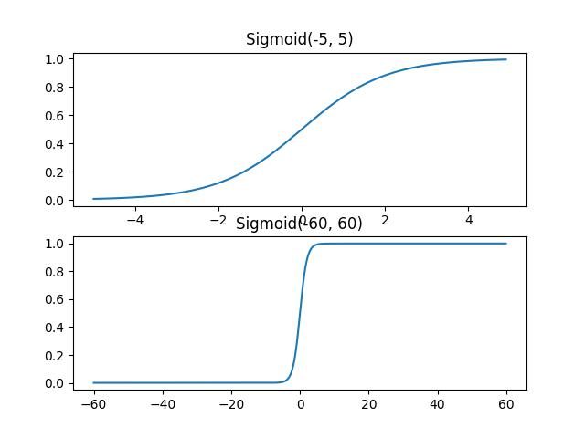
## Logistic分类器回归系数
  - 在每个特征 **x** 上乘以一个回归系数 **w** ，然后把所有的结果值相加
    ```
    z = wTx = w0x0 + w1x1 + w2x2 + ... + wnxn
    其中的向量x是分类器的输入数据
    ```
  - 将这个总和 **z** 代入Sigmoid函数中，进而得到一个范围在0~1之间的数值
    ```
    r = sigmoid(z)
    ```
  - 最后，结果大于0.5的数据被归入1类，小于0.5的即被归入0类，所以，Logistic 回归也可以被看成是一种概率估计
  - 向量w也就是我们要找到的最佳系数，从而使得分类尽可能地精确
  - **用 Logistic 回归进行分类**：把测试集上每个特征向量乘以最优化方法得来的回归系数，再将该乘积结果求和，最后输入到 Sigmoid 函数中即可，如果对应的 Sigmoid 值大于0.5就预测类别标签为1，否则为0
## 梯度上升的最优化方法确定最佳回归系数
  - 梯度上升法基于的思想：要找到某函数的最大值，最好的方法是沿着该函数的梯度方向探寻
  - 在 **一元函数** 的情况，梯度只是导数，对于一个线性函数，也就是线的斜率
  - 在 **二元函数** 的情形
    ```shell
    设函数z=f(x,y)在平面区域D内具有一阶连续偏导数
    则对于每一点P(x, y) ∈ D，都可以定出一个向量(δf/δx) * i + (δf/δy) * j
    该向量称为函数z=f(x,y)在点P(x,y)的梯度，记作grad f(x,y)
    其中(δf/δx)是函数在x方向上的偏导数，(δf/δy)是函数在y方向上的偏导数

    对于 f(x, y) = 1 / (x^2 + y^2)
    δf/δx = -2x / (x^2 + y^2) ^2
    δf/δy = -2y / (x^2 + y^2) ^2
    ```
  - **梯度上升算法**
    ```shell
    从P0开始，计算该点的梯度，函数根据梯度移动到下一点P1
    在P1点，梯度再次被重新计算，并沿新的梯度方向移动到P2
    如此循环迭代，到达每个点后重新估计移动的方向，直到满足停止条件
    停止条件可以是迭代次数达到某个指定值或算法达到某个可以允许的误差范围
    迭代的过程中，梯度算子总是保证能选取到最佳的移动方向
    w := w + a * grad f(x1, x2)
    ```
## 两个数值型特征的简单测试数据集
  - 一个简单数据集，每个点包含两个数值型特征：X1和X2，通过使用梯度上升法找到最佳回归系数，也就是拟合出Logistic回归模型的最佳划分线性函数

  ```python
  df = pd.read_table('Ch05/testSet.txt', header=None)
  grouped = df.groupby(df.iloc[:, 2])
  scatterFunc = lambda x : plt.scatter(x.iloc[:, 0], x.iloc[:, 1], label = x.iloc[0, 2])
  grouped.agg(scatterFunc) # apply while create tree labels [ ??? ]
  plt.legend(loc='best')
  ```

  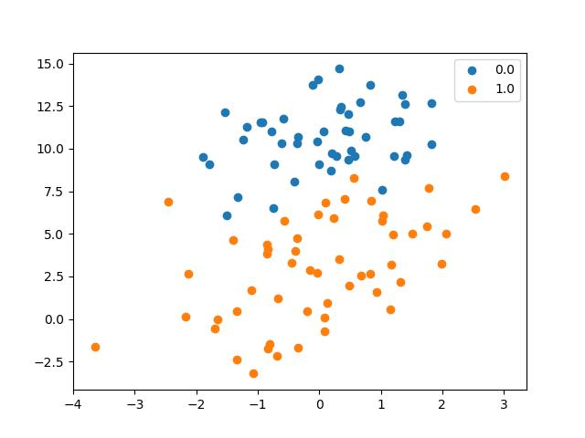
## python实现 梯度上升 算法与绘制最佳拟合直线
  - 对于两个特征值 **(x, y)** 的数据集，添加常数项的情况下，得出的回归系数 **w** 含有三个值 **[a, b, c]**
    ```
    z = a * x + b * y + c
    r = sigmoid(z)
    ```
  - 在绘制最佳拟合直线时
    ```
    y = f(x) = ( -c - a * x ) / b

    其中位于直线以上的点 y0 > f(x0)
    位于直线以下的点 y1 < f(x1)
    ```
  ```python
  # 梯度上升算法python实现
  def gradAscent(dataSet, labelSet, maxCycle = 500,
                 alpha = 0.001, constant=True):
      ''' dataSet, 特征数据集,
          labelSet, 分类标签数据集
          maxCycle, 最大迭代次数
          alpha, 每次迭代移动步长
          constant, 指定是否在特征数据集上添加常数项
      '''
      # 特征数据集的最后一列添加全1的一列作为常数项
      if (constant == True):
          dataConst = np.ones(dataSet.shape[0])
          dataSet = np.column_stack([dataSet, dataConst])
      # 回归系数初始化为1
      weights = np.ones(dataSet.shape[1])
      sigmoid = lambda x : 1 / (1 + exp(-x))
      # 迭代
      for k in range(maxCycle):
          # 当前回归系数下的分类结果 h = sigmoid(z)
          h = sigmoid(np.dot(dataSet, weights))
          # 与目标分类的偏差error
          error = labelSet - h
          # 根据error更新回归系数weights
          weights = weights + alpha * np.dot(error, dataSet)
      return weights

  # 绘制最佳拟合直线
  def plotBestFit(dataSet, labelSet, mod):
      ''' dataSet, 特征数据集,
          labelSet, 分类标签数据集
          mod, weights值，作为函数系数
      '''
      fig, axes = plt.subplots()
      grouped = pd.DataFrame(dataSet).groupby(labelSet)
      for name, group in grouped:
          axes.scatter(group.iloc[:, 0], group.iloc[:, 1], label=name)

      x = np.arange(-3, 3, 0.1)
      y = (-mod[2] - mod[0] * x) / mod[1]
      axes.plot(x, y, label='logistic')
      axes.legend(loc='best')
  ```
  运行结果
  ```python
  dataSet = df.values[:, :-1]
  labelSet = df.values[:, -1]
  gradAscent(dataSet, labelSet)
  Out[4]: array([ 0.48007329, -0.6168482 ,  4.12414349])

  w = gradAscent(dataSet, labelSet)
  plotBestFit(dataSet, labelSet, w)
  ```
  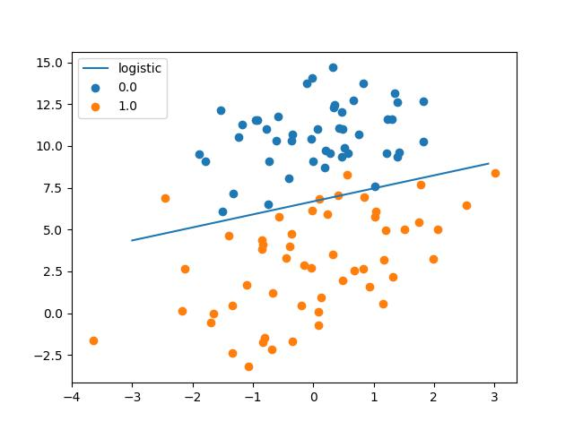
## python实现 随机梯度上升 算法
  - 梯度上升算法在每次更新回归系数时都需要遍历整个数据集，在数据集变大时，该方法的计算复杂度就会很高
  - 随机梯度上升算法与梯度上升算法的效果相当，但占用更少的计算资源
  - **随机梯度上升算法** 一次仅用一个样本点来更新回归系数，由于可以在新样本到来时对分类器进行增量式更新，因而随机梯度上升算法是一个 **在线学习算法**，与在线学习相对应，一次处理所有数据被称作是 **批处理**
  ```python
  def stocGradAscent0(dataSet, labelSet, numIter=1,
                 alpha = 0.01, constant=True):
      ''' dataSet, 特征数据集,
          labelSet, 分类标签数据集
          numIter, 最大迭代次数，默认迭代一次
          alpha, 每次迭代移动步长
          constant, 指定是否在特征数据集上添加常数项
      '''
      # 特征数据集的最后一列添加全1的一列作为常数项
      if (constant == True):
          dataConst = np.ones(dataSet.shape[0])
          dataSet = np.column_stack([dataSet, dataConst])
      # 回归系数初始化为1
      weights = np.ones(dataSet.shape[1])
      sigmoid = lambda x : 1 / (1 + exp(-x))
      # 增加迭代次数可以更好地收敛
      for i in range(numIter):
          # 每次只取一个样本值更新回归系数
          for k in range(dataSet.shape[0]):
              # h / error值都是标量
              h = sigmoid(np.dot(dataSet[k], weights))
              # 用于收集weights的变化情况，检查是否收敛
              # h = sigmoid(np.dot(dataSet[k], weights[-1]))
              error = labelSet[k] - h
              weights = weights + alpha * error * dataSet[k]
              # weights = np.vstack([weights, (weights[-1] + alpha * error * dataSet[k])])
      return weights
  ```
  运行结果
  ```python
  w = stocGradAscent0(dataSet, labelSet)
  plotBestFit(dataSet, labelSet, w)
  ```
  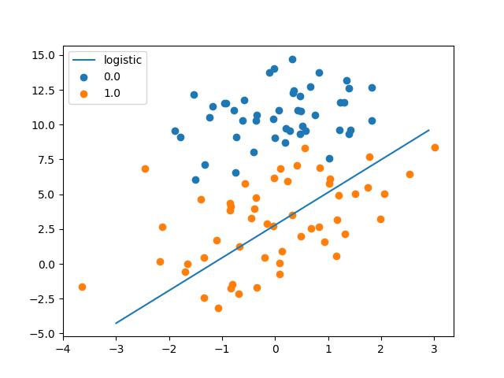
  - 随机梯度上升迭代一次拟合出来的直线效果，错分了三分之一的样本，但计算次数要少很多，增加迭代次数可以提高拟合精度
## 参数收敛
  - 一个判断优化算法优劣的可靠方法是看它是否收敛，也就是说参数是否达到了稳定值，是否还会不断地变化
  ```python
  # 使用 stocGradAscent0 的收集版本，收集计算过程中的weights值
  # 绘制 w 的收敛曲线
  def stackOfWeights(w):
      fig, axes = plt.subplots(3, 1)
      Series(w[:, 0]).plot(ax=axes[0])
      Series(w[:, 1]).plot(ax=axes[1])
      Series(w[:, 2]).plot(ax=axes[2])
      axes[0].set_ylabel('w0')
      axes[1].set_ylabel('w1')
      axes[2].set_ylabel('w2')
  ```
  运行结果
  ```python
  w = stocGradAscent0(dataSet, labelSet, alpha=0.01, numIter=200)
  w[-1]
  Out[49]: array([ 0.71586686, -1.04904507,  7.11305217])

  w.shape
  Out[50]: (20001, 3)

  stackOfWeights(w)
  ```
  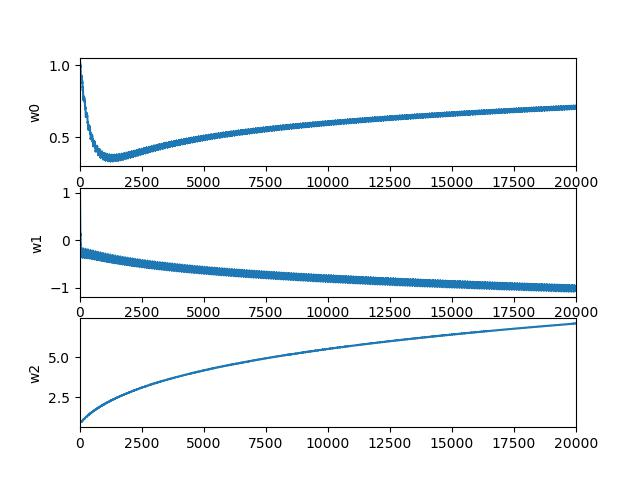
  - 回归系数经过大量迭代才能达到稳定值，并且仍然有局部的波动现象
## python实现 改进的随机梯度上升 算法
  - alpha在每次迭代时会随着迭代次数不断减小，这会缓解数据波动或者高频波动
  - 如果要处理的问题是动态变化的，那么可以适当加大常数项，来确保新的值获得更大的回归系数
  - 通过随机选取样本来更新回归系数，减少周期性的波动
  ```python
  def stocGradAscent1(dataSet, labelSet, numIter=200,
                 alpha = 0.01, constant=True):
      # 特征数据集的最后一列添加全1的一列作为常数项
      if (constant == True):
          dataConst = np.ones(dataSet.shape[0])
          dataSet = np.column_stack([dataSet, dataConst])
      # 回归系数初始化为1
      weights = np.ones(dataSet.shape[1])
      sigmoid = lambda x : 1 / (1 + exp(-x))
      for i in range(numIter):
          # 样本随机排序
          randInd = np.random.permutation(dataSet.shape[0])
          for j, k in enumerate(randInd):
              # 每次迭代调整alpha值
              alphaAdjust = 4/(1.0 + j + i) + alpha
              h = sigmoid(np.dot(dataSet[k], weights))
              # h = sigmoid(np.dot(dataSet[k], weights[-1]))
              error = labelSet[k] - h
              weights = weights + alphaAdjust * error * dataSet[k]
              # weights = np.vstack([weights, (weights[-1] + alphaAdjust * error * dataSet[k])])
      return weights
  ```
  运行结果
  ```python
  w = stocGradAscent1(dataSet, labelSet)
  plotBestFit(dataSet, labelSet, w)
  ```
  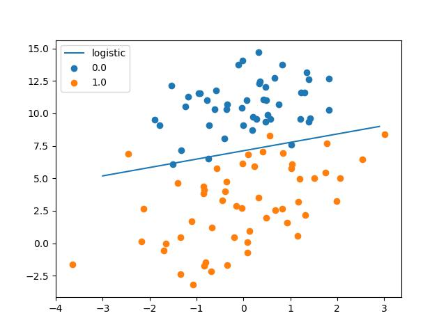

  参数收敛结果
  ```python
  # 使用 stocGradAscent1 的收集版本
  w = stocGradAscent1(dataSet, labelSet, alpha=0.01)
  w[-1]
  Out[78]: array([  1.34771352,  -2.17005703,  15.89608285])
  stackOfWeights(w[:4000])
  ```
  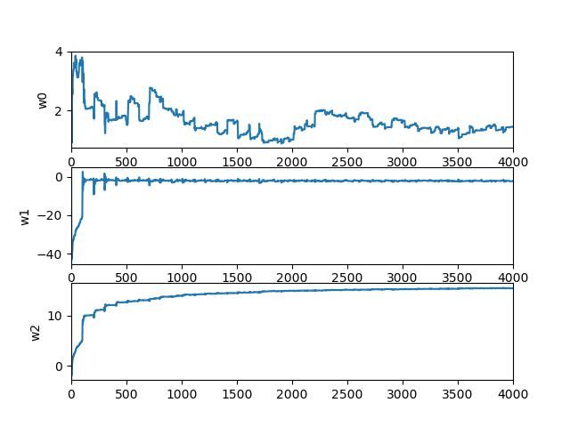
  - 该方法比采用固定alpha的方法收敛速度更快
## 从疝气病症预测病马的死亡率
  - 疝病是描述马胃肠痛的术语，这种病不一定源自马的胃肠问题，其他问题也可能引发马疝病
  - 该数据集中包含了医院检测马疝病的一些指标，有的指标比较主观，有的指标难以测量，例如马的疼痛级别
  - 该数据集还存在一个问题，数据集中有30%的数据值是缺失的
  ```python
  # 分别读取训练数据集与测试数据集，并返回测试结果
  def colicTest():
      path_train = 'Ch05/horseColicTraining.txt'
      path_test = 'Ch05/horseColicTest.txt'

      dfTrain = pd.read_table(path_train, header=None)
      dataSetTrain = dfTrain.values[:, :-1]
      labelSetTrain = dfTrain.values[:, -1]

      # 不添加常数项
      w = stocGradAscent1(dataSetTrain, labelSetTrain, numIter=500, constant=False)
      dfTest = pd.read_table(path_test, header=None)
      dataTest = dfTest.values[:, :-1]
      # dataConst = np.ones(dataTest.shape[0])
      # dataTest = np.column_stack([dataTest, dataConst])
      r = np.dot(dataTest, w)

      rs = sigmoid(r)
      rsb = np.where(rs > 0.5, 1, 0)
      rr = dfTest.values[:, -1]
      return pd.value_counts((rr == rsb))

  # 多次重复计算得出错误率
  def multiColicTest(num = 10):
    r = colicTest()
    for i in range(num - 1):
        r += colicTest()
    print('error rate = %f %%' %(r[False] / r.sum() * 100))
    return r
  ```
  运行结果
  ```python
  colicTest()
  /opt/anaconda3/bin/ipython:9: RuntimeWarning: overflow encountered in exp
  Out[103]:
  True     49
  False    18
  dtype: int64

  multiColicTest(50)
  error rate = 31.044776 %
  Out[130]:
  True     2310
  False    1040
  dtype: int64
  ```
  - 50次迭代之后的平均错误率为31%，事实上，这个结果并不差，因为数据集有30%的数据已经缺失，如果调整colicTest()中的迭代次数和stocGradAscent1()中的步长，平均错误率可以降到20%左右
***

# 支持向量机 Support Vector Machine(SVM)
## 介绍
  - 支持向量机(Support Vector Machine)是Cortes和Vapnik于1995年首先提出的，它在解决小样本、非线性及高维模式识别中表现出许多特有的优势，并能够推广应用到函数拟合等其他机器学习问题中
  - 支持向量机方法是建立在 **统计学习理论** 的 VC 维理论和结构风险最小原理基础上的，根据有限的样本信息在模型的复杂性（即对特定训练样本的学习精度，Accuracy）和学习能力（即无错误地识别任意样本的能力）之间寻求最佳折衷，以期获得最好的推广能力（或称泛化能力）
  - **分隔超平面** separating hyperplane，将数据集分隔开来的对象被称之为超平面hyperplane，也就是分类的决策边界，分布在超平面一侧的所有数据都属于某个类别，而分布在另一侧的所有数据则属于另一个类别
  - **间隔** margin，如果数据点离决策边界越远，那么其最后的预测结果也就越可信，找到离分隔超平面最近的点，并确保它们离分隔面的距离尽可能远，点到分隔面的距离被称为间隔，间隔应尽可能地大
  - **最大的数据集间隔** 一个是点到分隔面的距离，称为点相对于分隔面的间隔,另一个是数据集中所有点到分隔面的最小间隔的2倍，称为分类器或数据集的间隔，一般论文书籍中所提到的“间隔”多指后者，SVM分类器是要找最大的数据集间隔
  - **支持向量** support vector，就是离分隔超平面最近的那些点，最大化支持向量到分隔面的距离，SVM需要找到此问题的优化求解方法
  - **硬间隔最大化**，这个是相对训练数据集或说特征空间来说的，假如数据是完全的线性可分的，则学习到的模型可以称为硬间隔支持向量机，除此之外还有 **软间隔支持向量机**（近似线性可分），**非线性支持向量机** 等
  - **优点**：泛化错误率低，计算开销不大，结果易解释
  - **缺点**：对参数调节和核函数的选择敏感，原始分类器不加修改仅适用于处理二类问题
  - **适用数据类型**：数值型和标称型数据
  - **分类器工作原理**：输入数据给分类器 f(x) 会输出一个类别标签，相当于阶跃函数，其中当u<0时f(u)输出-1，反之则输出+1，此处采用-1 / +1方便数学上处理
## 数学基础
  - **点到直线距离**
    ```
    设直线 L 的方程为 Ax+By+C=0，则点 P0(x0，y0) 到直线 L 的距离为
    D(P0) = |Ax0 + By0 + C| / sqrt(A^2 + B^2)
    ```
  - **两条平行线的距离**
    ```
    两条直线 ax + by = c1 和 ax + by = c2
    距离是 |c2 - c1| / sqrt(a^2 + b^2)
    ```
  - **拉格朗日乘子 Lagrange multiplier**
    ```
    设给定二元函数 z = ƒ(x, y) 和附加条件 φ(x, y) = 0，为寻找 z = ƒ(x, y) 在附加条件下的极值点
    先做拉格朗日函数
        F(x, y, λ) = f(x, y) + λφ(x, y)
    令 F(x, y, λ) 对 x / y / λ的一阶偏导数等于零，即
        F'x = ƒ'x(x, y) + λφ'x(x, y) = 0
        F'y = ƒ'y(x, y) + λφ'y(x, y) = 0
        F'λ = φ(x, y) = 0
    由上述方程组解出x，y及λ，如此求得的(x, y)，就是函数 z = ƒ(x, y) 在附加条件φ(x, y) = 0下的可能极值点
    ```
## 寻找最大间隔
  - **分隔超平面**
    ```c
    g(x) = w*x + b = 0，其中常数b类似于Logistic回归中的截距w0
    目标就是找出分类器定义中的 w 和 b
    ```
  - **点A到分隔超平面的距离**:
    ```c
    D(A) = |w*A + b| / ||w||
    ```
  - **间隔**: 类别标签采用 -1 / +1，因此间隔
    ```c
    Interv(x) = |w*A + b| = label ∗ (w*x + b)

    点到分隔面的函数间隔 Interv(x) = label ∗ (w*x + b)
    点到分隔面的几何间隔 D(x) = label ∗ (w*x + b) / ||w||
    ```
  - **支持向量** 就是具有最小间隔的数据点
    ```c
    sv = { min[i=1, N] (D(xi)) }
       = { min[i=1, N] Interv(xi) / ||w|| }
       = { min[i=1, N] (label * (w*xi + b)) / ||w|| }
    ```
  - **间隔最大化**，一旦找到具有最小间隔的数据点，就需要对该间隔最大化
    ```c
    假设两个和这个超平面平行和距离相等的超平面
        H1: y = wTx + b = +1
        H2: y = wTx + b = -1
    ```
    ```c
    需要两个条件
        没有任何样本在这两个平面之间
        这两个平面的距离需要最大
    支持向量会处于这两条线上
    ```
    ```c
    H1 与 H2之间距离就是
        |1 + 1| / sqrt(w^2) = 2 / ||w||

    为了最大化这个距离，应该最小化||w||，即
        min 1/2 * ||w||^2   # 数学计算上容易求导
    ```
  - **约束条件**
    ```c
    并非所有数据点的间隔都等于1，只有那些离分隔超平面最近的点得到的值才为1
    离超平面越远的数据点，其函数间隔也就越大

    对于任何一个正样本yi = +1，要处于H1的右边，也就是：y= w*x + b >= +1
    对于任何一个负样本yi = -1，要处于H2的左边，也就是：y = w*x + b <= -1

    即完全线性可分下的约束条件
        s.t. label(i) * (w*xi + b) - 1 >= 0, i=1,2,...N
    ```
  - **拉格朗日对偶性**，上述优化问题给定了一些约束条件然后求最优值，通过引入 **拉格朗日乘子**，可以基于约束条件来表述原来的问题
    ```c
    L(w, b, α) = 1/2 * w*w - Σ(i=1, N)label(i) * αi * (w*xi + b)
    结果中只有支持向量的αi不为0，其他情况αi都是0
    ```
  - 引入 **拉格朗日对偶性**，通过求解对偶问题得到原始问题的最优解
    - 首先可以降低计算的难度
    - 其次自然引入核函数（非线性可分数据的处理方式）利用拉格朗日对偶性可以构造等价对偶函数
  - **求解极值**
    ```
    偏导数为0得出
    L'(w) = 0 ==> w = Σ(i=1, N)label(i) * αi * xi
    L'(b) = 0 ==> Σ(i=1, N)label(i) * αi = 0
    ```
  - **最终公式**
    ```c
    min[α] (1/2 * Σ(i,j=1, N)label(i) * label(j) * αi * αj * <xi, xj> - Σ(i=1, N)αi)
    其中<xi, xj>表示xi, xj两个向量的内积
    ```
    ```c
    约束条件
    Σ(i=1, N)αi * label(i) = 0
    αi >= 0, i=1,2,...N
    ```
  - **目标函数中的 w / b**
    ```
    w = Σ(i=1, N) αi * label(i) * xi
    b = label(i) - Σ(i=1, N) αi * label(i) * <xi, xj>
    ```
  - **松弛变量** slack variable，上述优化有个假设，数据必须100%线性可分，但几乎所有数据都不可能那么干净，引入松弛变量，来允许有些数据点可以处于分隔面的错误一侧，此时优化目标就能保持仍然不变，但是新的约束条件则变为
    ```
    C >= α >= 0 && Σ(i=1, m)αi * label(i) = 0
    常数C用于控制“最大化间隔”和“保证大部分点的间隔不小于1.0”这两个目标的权重
    在优化算法的实现代码中，C是一个参数，可通过调节该参数得到不同的结果
    ```
  - **SVM的主要工作** 就是求解这些alpha，一旦求出所有的alpha，那么分隔超平面可通过这些alpha来表达
## 简化版SMO高效优化算法
  - 1996年，John Platt发布了一个称为SMO1的强大算法，用于训练SVM，SMO表示 **序列最小优化** Sequential Minimal Optimization
  - **SMO算法的思想** 是将大优化问题分解为多个小优化问题来求解的,这些小优化问题往往很容易求解，并且对它们进行顺序求解的结果与将它们作为整体来求解的结果是完全一致的,在结果完全相同的同时，SMO算法的求解时间短很多
  - **SMO算法的目标** 是求出一系列alpha和b，一旦求出了这些alpha，就很容易计算出权重向量w并得到分隔超平面
  - **SMO算法的工作原理**
    - 每次循环中选择两个alpha进行优化处理，一旦找到一对合适的alpha，那么就增大其中一个同时减小另一个
    - 两个alpha必须要符合一定的条件，这两个alpha必须要在间隔边界之外，并且这两个alpha还没有进行过区间化处理或者不在边界上
  - **Platt SMO算法中的外循环确定要优化的最佳alpha对**，而简化版却会跳过这一部分
    - 首先在数据集上遍历每一个alpha，然后在剩下的alpha集合中随机选择另一个alpha，从而构建alpha对
    - 有一点相当重要，就是要同时改变两个alpha，因为约束条件 **Σ(i=1, m)αi * label(i) = 0**，改变一个alpha可能会导致该约束条件失效
  - **简化版SMO函数的伪代码**
    ```
    创建一个alpha向量并将其初始化为0向量
    当迭代次数小于最大迭代次数时（外循环）
       对数据集中的每个数据向量（内循环）：
       如果该数据向量可以被优化：
           随机选择另外一个数据向量
           同时优化这两个向量
           如果两个向量都不能被优化，退出内循环
      如果所有向量都没被优化，增加迭代数目，继续下一次循环
    ```
## python实现简化版SMO函数
  ```python
  # 随机选取函数，随机选取(1, m)范围内除 i 以外的一个整数
  def selectJrand(i, m):
      l = list(np.arange(m))
      return np.random.choice(l[:i] + l[i+1:])

  # alpha调整函数，将x调整到(L, H)范围以内
  adjustAlpha = lambda x, H, L : max(L, min(x, H))

  # python实现简化版SMO函数
  def smoSimple(dataSet, labelSet, C, toler, maxIter):
      ''' 参数
          dataSet 数据集
          labelsSet 类别标签
          C 常数C
          toler 容错率
          maxIter 退出前最大的循环次数
      '''
      b = 0
      m = dataSet.shape[0]
      alphas = np.zeros(m)

      # iter变量存储的是在没有任何alpha改变的情况下遍历数据集的次数
      iter = 0
      while (iter < maxIter):
          # alphaPairsChanged记录alpha是否已经进行优化
          alphaPairsChanged = 0
          for i in range(m):
              # fXi预测的类别
              # fXi = w * xi + b
              fXi = np.dot(alphas * labelSet, np.dot(dataSet, dataSet[i, :])) + b
              # 预测结果与真实结果比对，计算误差Ei
              Ei = fXi - labelSet[i]
              # 如果误差很大，那么可对该数据实例所对应的alpha值进行优化
              # if语句分别对正间隔和负间隔做了测试，并且检查了alpha值，保证其不能等于0或者C
              # 由于后面alpha小于0或者大于C时将被调整为0或C
              # 所以一旦该if语句中它们等于这两个值得话，那么它们就已经在“边界”上了，因而不再能够减小或增大，
              # 因此也就不值得对它们进行优化
              if (((labelSet[i] * Ei < -toler) and (alphas[i] < C)) or
                ((labelSet[i] * Ei > toler) and (alphas[i] > 0))):
                  # 利用辅助函数，随机选择第二个alpha值
                  j = selectJrand(i, m)
                  fXj = np.dot(alphas * labelSet, np.dot(dataSet, dataSet[j, :])) + b
                  Ej = fXj - labelSet[j]

                  alphaIold = alphas[i].copy()
                  alphaJold = alphas[j].copy()
                  # L和H用于将alphas[j]调整到0-C之间。如果L==H，就不做任何改变，直接执行continue语句
                  if labelSet[i] != labelSet[j]:
                      t = alphas[j] - alphas[i]
                  else :
                      t = alphas[j] + alphas[i] - C
                  L, H = (t, C) if t > 0 else (0, C + t)
                  if L == H :
                      # print('L == H, |t| == C')
                      continue
                  # eta是alphas[j]的最优修改量，如果eta==0，需要退出for循环的当前迭代过程
                  # eta = -(dataMatrix[i, :] - dataMatrix[j, :]) ** 2
                  dt = dataSet[i, :] - dataSet[j, :]
                  eta = -np.dot(dt, dt)
                  if eta >= 0 :
                      # print('eta >= 0')
                      continue
                  # 计算出一个新的alphas[j]值
                  # aj = ajo - lj * ((fi-li) - (fj-lj)) / -(di - dj)^2
                  #    ==> ajo - aj = lj * ((fi-li) - (fj-lj)) / -(di - dj)^2
                  alphas[j] -= labelSet[j] * (Ei - Ej) / eta
                  # 并使用辅助函数，以及L和H对其进行调整
                  alphas[j] = adjustAlpha(alphas[j], H, L)
                  # 检查alphas[j]是否有轻微改变，如果是的话，退出for循环
                  if ( abs(alphas[j] - alphaJold) < 0.00001):
                      # print('j not moving enough')
                      continue
                  # 然后alphas[i]和alphas[j]同样进行改变，虽然改变的大小一样，但是改变的方向正好相反
                  # ai = aio + lj * li * (ajo - aj)
                  #    = aio + lj * li * lj * (Ei - Ej) / eta
                  # ai * li + aj * lj = aio * li + ajo * lj +
                  #     lj^2 * (li ^2 -1) * (Ei - Ej) / eta
                  #     = 0
                  #     = lj * li * li * (ajo-aj) - (ajo-aj) * lj
                  alphas[i] += labelSet[j] * labelSet[i] * (alphaJold - alphas[j])
                  # 在对alphas[i]和alphas[j]进行优化后，给这两个alpha值设置一个常数项b
                  # b1 = b - Ei - li * (lj * li * (ajo - aj)) * di^2 - lj * (aj - ajo) * di * dj
                  #    = b - Ei - lj * (ajo - aj) (li^2 * di ^2 - di * dj)
                  b1 = b - Ei - \
                     labelSet[i] * (alphas[i] - alphaIold) * np.dot(dataSet[i, :], dataSet[i, :]) - \
                     labelSet[j] * (alphas[j] - alphaJold) * np.dot(dataSet[i, :], dataSet[j, :])
                  # b2 = b - Ej - li * (lj * li * (ajo - aj)) * di * dj - lj * (aj - ajo) * dj * dj
                  #    = b - Ej - lj * (ajo - aj) (li^2 * di * dj - dj ^ 2)
                  b2 = b - Ej - \
                     labelSet[i] * (alphas[i] - alphaIold) * np.dot(dataSet[i, :], dataSet[j, :]) - \
                     labelSet[j] * (alphas[j] - alphaJold) * np.dot(dataSet[j, :], dataSet[j, :])
                  if (0 < alphas[i]) and (C > alphas[i]):
                      b = b1
                  elif (0 < alphas[j]) and (C > alphas[j]):
                      b = b2
                  else:
                      b = (b1 + b2) / 2.0
                  # 成功地改变了一对alpha，同时可以增加alphaPairsChanged的值
                  alphaPairsChanged += 1
                  # print('iter: %d i:%d, pairs changed %d' % (iter, i, alphaPairsChanged))
          # 检查alpha值是否做了更新
          # 如果有更新则将iter设为0后继续运行程序
          # 只有在所有数据集上遍历maxIter次，且不再发生任何alpha修改之后，程序才会停止并退出while循环
          if alphaPairsChanged == 0:
              iter += 1
          else:
              iter = 0
          # print('iteration number: %d' % iter)

      return b, alphas
  ```
  运行结果
  ```python
  df = pd.read_table('Ch06/testSet.txt', header=None)
  dataSet = df.values[:, :-1]
  labelSet = df.values[:, -1]
  b, alphas = smoSimple(dataSet, labelSet, 0.6, 0.001, 40)

  b, alphas[alphas>0]
  Out[25]: (-3.8301163226276493, array([ 0.13036868,  0.23879601,  0.36916469]))

  # 支持向量
  dataSet[alphas>0]
  Out[26]:
  array([[ 4.658191,  3.507396],
         [ 3.457096, -0.082216],
         [ 6.080573,  0.418886]])

  labelSet[alphas>0]
  Out[27]: array([-1., -1.,  1.])

  # w, b绘制点线
  grouped = df.groupby(df.iloc[:, 2])
  scatterFunc = lambda x : plt.scatter(x.iloc[:, 0], x.iloc[:, 1], label = x.iloc[0, 2])
  grouped.agg(scatterFunc)
  plt.scatter(dataSet[alphas>0][:, 0], dataSet[alphas>0][:, 1], color = 'r', marker='D')
  w = np.dot(alphas * labelSet, dataSet)
  x = arange(3, 7)
  y = (-b - w[0] * x) / w[1]
  plt.plot(x, y)
  ```
  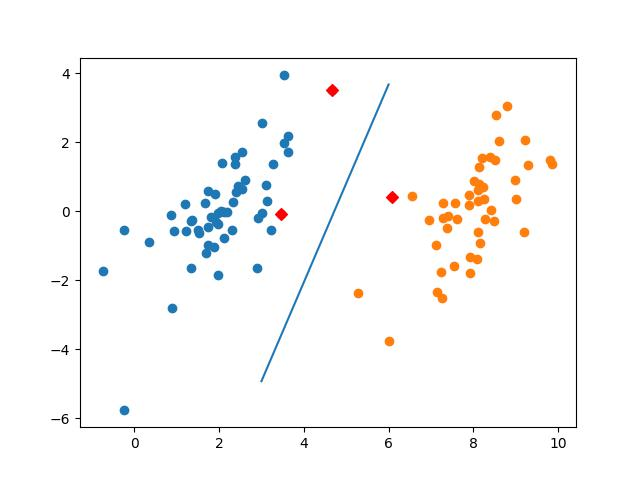
## > 利用完整Platt SMO算法加速优化
  - 在几百个点组成的小规模数据集上，简化版SMO算法的运行是没有什么问题的，但是在更大的数据集上的运行速度就会变慢
  - 实现alpha的更改和代数运算的优化环节是一样的，在优化过程中，唯一的不同就是 **选择alpha的方式**，完整版的Platt SMO算法应用了一些能够提速的启发方法
  - Platt SMO算法通过一个 **外循环来选择第一个alpha值** ，其选择过程会在两种方式之间进行交替
    - 一种方式是在 **所有数据集上进行单遍扫描**
    - 另一种方式则是在 **非边界alpha中实现单遍扫描**，非边界alpha指的是那些不等于边界0或C的alpha值
    - 对整个数据集的扫描相当容易，而实现非边界alpha值的扫描时，首先需要建立这些alpha值的列表，然后再对这个表进行遍历
    - 同时，该步骤会跳过那些已知的不会改变的alpha值
  - 在选择第一个alpha值后，算法会通过一个 **内循环来选择第二个alpha值**，在优化过程中，会通过 **最大化步长的方式** 来获得第二个alpha值，简化版SMO算法中，会在选择j之后计算错误率Ej，但在这里，会建立一个全局的缓存用于保存误差值，并从中选择使得步长或者说Ei-Ej最大的alpha值
  ```python
  class optStruct:
      def __init__(self,dataMatIn, classLabels, C, toler):
          self.X = dataMatIn
          self.labelMat = classLabels
          self.C = C
          self.tol = toler
          self.m = shape(dataMatIn)[0]
          self.alphas = mat(zeros((self.m,1)))
          self.b = 0
          # 误差缓存，第一列给出的是eCache是否有效的标志位，而第二列给出的是实际的E值
          self.eCache = mat(zeros((self.m,2)))

  # 对于给定的alpha值，计算E值并返回
  def calcEk(oS, k):
      fXk = float(multiply(oS.alphas,oS.labelMat).T*(oS.X*oS.X[k,:].T)) + oS.b
      Ek = fXk - float(oS.labelMat[k])
      return Ek

  # 选择第二个alpha或者说内循环的alpha值，
  def selectJ(i, oS, Ei):
      #❷  内循环中的启发式方法
      maxK = -1; maxDeltaE = 0; Ej = 0
      # 将输入值Ei在缓存中设置成为有效的
      oS.eCache[i] = [1,Ei]
      validEcacheList = nonzero(oS.eCache[:,0].A)[0]
      if (len(validEcacheList)) > 1:
          for k in validEcacheList:
              if k == i: continue
              Ek = calcEk(oS, k)
              deltaE = abs(Ei - Ek)
              # 选择其中使得改变最大的那个j (最大步长)
              if (deltaE > maxDeltaE):
                  maxK = k; maxDeltaE = deltaE; Ej = Ek
          return maxK, Ej
      else:
          # 如果是第一次循环，随机选择一个alpha值
          j = selectJrand(i, oS.m)
          Ej = calcEk(oS, j)
      return j, Ej

  # 在对alpha值进行优化之后，计算误差值并存入缓存当中
  def updateEk(oS, k):
      Ek = calcEk(oS, k)
      oS.eCache[k] = [1,Ek]

  def innerL(i, oS):
      Ei = calcEk(oS, i)
      if ((oS.labelMat[i]*Ei < -oS.tol) and (oS.alphas[i] < oS.C)) or((oS.labelMat[i]*Ei > oS.tol) and (oS.alphas[i] > 0)):
          # 使用程序selectJ()而不是selectJrand()来选择第二个alpha的值
          j,Ej = selectJ(i, oS, Ei)
          alphaIold = oS.alphas[i].copy(); alphaJold = oS.alphas[j].copy();
          if (oS.labelMat[i] != oS.labelMat[j]):
              L = max(0, oS.alphas[j] - oS.alphas[i])
              H = min(oS.C, oS.C + oS.alphas[j] - oS.alphas[i])
          else:
              L = max(0, oS.alphas[j] + oS.alphas[i] - oS.C)
              H = min(oS.C, oS.alphas[j] + oS.alphas[i])
          if L==H: print "L==H"; return 0
          eta = 2.0 * oS.X[i,:]*oS.X[j,:].T - oS.X[i,:]*oS.X[i,:].T - oS.X[j,:]*oS.X[j,:].T
          if eta >= 0: print "eta>=0"; return 0
          oS.alphas[j] -= oS.labelMat[j]*(Ei - Ej)/eta
          oS.alphas[j] = clipAlpha(oS.alphas[j],H,L)
          # 在alpha值改变时更新Ecache
          updateEk(oS, j)
          if (abs(oS.alphas[j] - alphaJold) < 0.00001):
              print "j not moving enough"; return 0
          oS.alphas[i] += oS.labelMat[j]*oS.labelMat[i]*(alphaJold - oS.alphas[j])

          # 更新错误差值缓存
          updateEk(oS, i)
          b1 = oS.b - Ei- oS.labelMat[i]*(oS.alphas[i]-alphaIold)*oS.X[i,:]*oS.X[i,:].T - oS.labelMat[j]*(oS.alphas[j]-alphaJold)*oS.X[i,:]*oS.X[j,:].T
          b2 = oS.b - Ej- oS.labelMat[i]*(oS.alphas[i]-alphaIold)*oS.X[i,:]*oS.X[j,:].T - oS.labelMat[j]* (oS.alphas[j]-alphaJold)*oS.X[j,:]*oS.X[j,:].T
          if (0 < oS.alphas[i]) and (oS.C > oS.alphas[i]): oS.b = b1
          elif (0 < oS.alphas[j]) and (oS.C > oS.alphas[j]): oS.b = b2
          else: oS.b = (b1 + b2)/2.0
          return 1
      else: return 0

  # Platt SMO的外循环
  def smoP(dataMatIn, classLabels, C, toler, maxIter,kTup=('lin', 0)):    #full Platt SMO
      oS = optStruct(mat(dataMatIn),mat(classLabels).transpose(),C,toler, kTup)
      iter = 0
      entireSet = True; alphaPairsChanged = 0
      # 当迭代次数超过指定的最大值，或者遍历整个集合都未对任意alpha对进行修改时，就退出循环
      while (iter < maxIter) and ((alphaPairsChanged > 0) or (entireSet)):
          alphaPairsChanged = 0
          if entireSet:   #go over all
              # for循环在数据集上遍历任意可能的alpha
              for i in range(oS.m):
                  alphaPairsChanged += innerL(i,oS)
                  print "fullSet, iter: %d i:%d, pairs changed %d" % (iter,i,alphaPairsChanged)
              iter += 1
          else:#go over non-bound (railed) alphas
              nonBoundIs = nonzero((oS.alphas.A > 0) * (oS.alphas.A < C))[0]
              # for循环遍历所有的非边界alpha值
              for i in nonBoundIs:
                  alphaPairsChanged += innerL(i,oS)
                  print "non-bound, iter: %d i:%d, pairs changed %d" % (iter,i,alphaPairsChanged)
              iter += 1
          # 在非边界循环和完整遍历之间进行切换
          if entireSet: entireSet = False #toggle entire set loop
          elif (alphaPairsChanged == 0): entireSet = True  
          print "iteration number: %d" % iter
      return oS.b,oS.alphas
  ```
  运行结果
  ```python
  # w的计算
  w = np.dot(alphas * labelSet, dataSet)
  # 对数据进行分类处理
  # 如果该值大于0，那么其属于1类；如果该值小于0，那么则属于-1类
  np.dot(dataSet[0], w) + b
  Out[64]: -1.5135092432915522

  labelArr[0]
  Out[65]: -1.0
  ```
## > 在复杂数据上应用核函数
  - 核函数并不仅仅应用于支持向量机，很多其他的机器学习算法也都用到核函数
  - **核函数将数据从一个特征空间转换到另一个特征空间**
    - 在新空间下，可以很容易利用已有的工具对数据进行处理
    - 数学上将这个过程称之为从一个特征空间到另一个特征空间的映射
    - 在通常情况下，这种映射会将低维特征空间映射到高维空间
  - **核技巧 kernel trick** 也称核变电 kernel substation
    - SVM优化中所有的运算都可以写成内积（inner product，也称点积）的形式，向量的内积指的是两个向量相乘，之后得到单个标量或者数值
    - 可以把内积运算替换成核函数，而不必做简化处理
    - 将内积替换成核函数的方式被称为 **核技巧**
  - **径向基函数** 是SVM中常用的一个核函数，采用向量作为自变量，能够基于向量距离运算输出一个标量，这个距离可以是从<0, 0>向量或者其他向量开始计算的距离
    ```
    径向基函数的高斯版本
    k(x, y) = exp(-||x-y||^2 / 2σ^2)
    其中，σ是用户定义的用于确定到达率（reach） 或者说函数值跌落到0的速度参数

    高斯核函数将数据从其特征空间映射到更高维的空间，具体来说这里是映射到一个无穷维的空间
    ```
## > python实现的核转换函数
  ```python
  # 核转换函数
  # 元组kTup给出的是核函数的信息。元组的第一个参数是描述所用核函数类型的一个字符串，其他2个参数则都是核函数可能需要的可选参数。该函数首先构建出了一个列向量，然后检查元组以确定核函数的类型
  def kernelTrans(X, A, kTup):
      m,n = shape(X)
      K = mat(zeros((m,1)))
      # 线性核函数
      if kTup[0]=='lin': K = X * A.T
      # 径向基核函数
      elif kTup[0]=='rbf':
          for j in range(m):
              deltaRow = X[j,:] - A
              K[j] = deltaRow*deltaRow.T
          # 元素间的除法  
          K = exp(K /(-1*kTup[1]**2))
      # 如果遇到一个无法识别的元组，程序就会抛出异常
      else: raise NameError('Houston We Have a Problem -- That Kernel is not recognized')
      return K

  class optStruct:
      def __init__(self,dataMatIn, classLabels, C, toler, kTup):
          self.X = dataMatIn
          self.labelMat = classLabels
          self.C = C
          self.tol = toler
          self.m = shape(dataMatIn)[0]
          self.alphas = mat(zeros((self.m,1)))
          self.b = 0
          self.eCache = mat(zeros((self.m,2)))
          # 引入新变量kTup，包含核函数信息的元组
          self.K = mat(zeros((self.m,self.m)))
          for i in range(self.m):
              self.K[:,i] = kernelTrans(self.X, self.X[i,:], kTup)
  ```
  - 使用核函数时需要对innerL()及calcEk()函数进行的修改
  ```python
  innerL():
                                .
                                .
                                .
  eta = 2.0 * oS.K[i,j] - oS.K[i,i] - oS.K[j,j]
                                .
                                .
                                .
  b1 = oS.b - Ei- oS.labelMat[i]*(oS.alphas[i]-alphaIold)*oS.K[i,i] -\
                     oS.labelMat[j]*(oS.alphas[j]-alphaJold)*oS.K[i,j]
  b2 = oS.b - Ej- oS.labelMat[i]*(oS.alphas[i]-alphaIold)*oS.K[i,j]-\
                     oS.labelMat[j]*(oS.alphas[j]-alphaJold)*oS.K[j,j]
                               .
                               .
                               .
  def calcEk(oS, k):
      fXk = float(multiply(oS.alphas,oS.labelMat).T*oS.K[:,k] + oS.b)
      Ek = fXk - float(oS.labelMat[k])
      return Ek
  ```
## > 利用核函数进行分类的径向基测试函数
  该分类器使用了径向基核函数。前面提到的径向基函数有一个用户定义的输入σ。首先，我们需要确定它的大小，然后利用该核函数构建出一个分类器
  ```python
  def testRbf(k1=1.3):
      # 输入参数是高斯径向基函数中的一个用户定义变量
      dataArr,labelArr = loadDataSet('testSetRBF.txt')
      b,alphas = smoP(dataArr, labelArr, 200, 0.0001, 10000, ('rbf', k1))
      datMat=mat(dataArr); labelMat = mat(labelArr).transpose()
      svInd=nonzero(alphas.A>0)[0]
      #构建支持向量矩阵
      sVs=datMat[svInd]
      labelSV = labelMat[svInd];
      print "there are %d Support Vectors" % shape(sVs)[0]
      m,n = shape(datMat)
      errorCount = 0
      for i in range(m):
          kernelEval = kernelTrans(sVs,datMat[i,:],('rbf', k1))
          predict=kernelEval.T * multiply(labelSV,alphas[svInd]) + b
          if sign(predict)!=sign(labelArr[i]): errorCount += 1
      print "the training error rate is: %f" % (float(errorCount)/m)
      dataArr,labelArr = loadDataSet('testSetRBF2.txt')
      errorCount = 0
      datMat=mat(dataArr); labelMat = mat(labelArr).transpose()
      m,n = shape(datMat)
      for i in range(m):
          kernelEval = kernelTrans(sVs,datMat[i,:],('rbf', k1))
          predict=kernelEval.T * multiply(labelSV,alphas[svInd]) + b
          if sign(predict)!=sign(labelArr[i]): errorCount += 1
      print "the test error rate is: %f" % (float(errorCount)/m)
  ```
***

# 利用AdaBoost元算法提高分类性能 adaptive boosting
## 介绍
  - 基于数据集多重抽样的分类器
  - **元算法meta-algorithm / 集成方法ensemble method** 是对其他算法进行组合的一种方式，使用集成方法时会有多种形式：
    - 可以是不同算法的集成
    - 也可以是同一算法在不同设置下的集成
    - 还可以是数据集不同部分分配给不同分类器之后的集成
  - **弱分类器** 意味着分类器的性能比随机猜测要略好，但是也不会好太多，在二分类情况下弱分类器的错误率会高于50%
  - **强分类器** 错误率将会低很多，AdaBoost算法即要解决使用弱分类器和多个实例来构建一个强分类器
  - **AdaBoost和SVM** 是监督机器学习中最强大的两种方法
    - 这两者之间拥有不少相似之处，可以把弱分类器想象成SVM中的一个核函数，也可以按照最大化某个最小间隔的方式重写AdaBoost算法
    - 它们的不同就在于其所定义的间隔计算方式有所不同，因此导致的结果也不同，特别是在高维空间下，这两者之间的差异就会更加明显
  - **优点**：泛化错误率低，易编码，可以应用在大部分分类器上，无参数调整
  - **缺点**：对离群点敏感
  - **适用数据类型**：数值型和标称型数据
## bagging / boosting
  - **bagging 基于数据随机重抽样的分类器构建方法**
    - **自举汇聚法** bootstrap aggregating，也称为bagging方法，是在从原始数据集选择S次后得到S个新数据集的一种技术
    - **新数据集** 和原数据集的大小相等，每个数据集都是通过在原始数据集中随机选择一个样本来进行替换而得到的
    - **替换** 意味着可以多次地选择同一样本。这一性质就允许新数据集中可以有重复的值，而原始数据集的某些值在新集合中则不再出现
    - 还有一些更先进的bagging方法，比如 **随机森林** random forest
    - 在S个数据集建好之后，将某个学习算法分别作用于每个数据集就得到了S个 **分类器**，对新数据进行分类时，就可以应用这S个分类器进行分类，与此同时，选择分类器投票结果中最多的类别作为最后的分类结果
  - **boosting**
    - boosting是一种与bagging很类似的技术，不同的分类器是通过 **串行训练** 而获得的，每个新分类器都根据已训练出的分类器的性能来进行训练
    - boosting是通过 **集中关注被已有分类器错分的那些数据** 来获得新的分类器。
    - 由于boosting分类的结果是基于 **所有分类器的加权求和** 结果的，bagging中的分类器权重是相等的，而boosting中的分类器权重并不相等
    - 每个权重代表的是其 **对应分类器在上一轮迭代中的成功度**
## AdaBoost运行过程
  - 基于错误提升分类器的性能
  - 训练数据中的每个样本，并赋予其一个权重，这些权重构成了 **向量D**，一开始，这些权重都初始化成相等值，D是一个概率分布向量，其所有的元素之和为1.0
  - 首先在训练数据上训练出一个 **弱分类器** 并计算该分类器的错误率
  - 然后在同一数据集上再次训练弱分类器，并 **重新调整每个样本的权重**，其中第一次分对的样本的权重将会降低，而第一次分错的样本的权重将会提高
  - 为了从所有弱分类器中得到最终的分类结果，AdaBoost **为每个分类器都分配了一个权重值alpha**，这些alpha值是基于每个弱分类器的错误率进行计算的
  - 其中，错误率ε的定义为
    ```
    ε = 未正确分类的样本数目 / 所有的样本数目
    ```
  - alpha的计算公式
    ```
    α = 1 / 2 * ln( (1 - ε) / ε )
    ```
  - 计算出alpha值之后，可以对权重向量D进行更新，以使得那些正确分类的样本的权重降低而错分样本的权重升高
    ```
    如果某个样本 xi 被正确分类，那么该样本的权重 Di 降低
    Di(t+1) = Di(t) * e^(-α) / sum(D)

    如果某个样本 xi 被错分，那么该样本的权重 Di 提高
    Di(t+1) = Di(t) * e^(α) / sum(D)
    ```
  - 在计算出D之后，AdaBoost又开始进入下一轮 **迭代**，AdaBoost算法会不断地重复 **训练和调整权重** 的过程，直到训练错误率为0或者弱分类器的数目达到用户的指定值为止
  - 最终分类器的结果是 **所有分类器的结果Ri与其权重alpha的乘积的总和**
    ```
    class = sign( Σ(i=1, N)(αi * Ri) )
    ```
## python实现基于单层决策树 decision stump 构建弱分类器
  - **单层决策树** 也称决策树桩，是一种简单的决策树，仅基于单个特征来做决策，相当于在数据的某一个坐标轴上选取某个 **阈值thresh** 来划分数据
  ```python
  # 一个简单数据集，无法通过单层决策树划分
  def loadSimpData():
      dataSet = np.array([[ 1. , 2.1],
          [ 2. , 1.1],
          [ 1.3, 1. ],
          [ 1. , 1. ],
          [ 2. , 1. ]])
      labelSet = [1.0, 1.0, -1.0, -1.0, 1.0]
      return dataSet, labelSet

  dataSet, labelSet = loadSimpData()

  df = DataFrame(dataSet)
  df[2] = labelSet
  scatterFunc = lambda x : plt.scatter(x.iloc[:, 0], x.iloc[:, 1], label = x.iloc[0, 2])
  df.groupby(labelSet).agg(scatterFunc)
  plt.legend(loc='best')
  ```
  基于单层决策树构建弱分类器
  ```python
  # 分类函数，根据阈值thresh划分 1 / -1
  def stumpClassify(data, thresh, threshIneq):
      if threshIneq == 'lt':
          return np.where(data >= thresh, 1, -1)
      else:
          return np.where(data < thresh, 1, -1)

  # 构建单层决策树，寻找错误率最低的分类特征与阈值
  # D是每个数据分类结果的权重向量
  def buildStump(dataSet, labelSet, D):
      minError = inf  # 无穷大
      r = pd.Series(index = ['row', 'thresh', 'inequal', 'minError', 'pv'])
      # 遍历每一列数据
      for row in np.arange(dataSet.shape[1]):
          stamp = dataSet[:, row]
          # 每一列数据中，设定步长，遍历数值范围内的多个值作为阈值
          for thresh in np.arange(stamp.min(), stamp.max(), (stamp.max() - stamp.min())/10):
              # 每个阈值分别取 大于 / 小于，划分数据
              for inequal in ['lt', 'gt']:
                  # print(row, thresh, inequal)
                  predictedVals = stumpClassify(stamp, thresh, inequal)
                  # 错误率为划分错误的数值其权重 D 的和
                  weightedError = D[np.array(labelSet) != predictedVals].sum()
                  # 保存错误率最低的数值划分方式
                  if (weightedError < minError):
                      minError = weightedError
                      r['row', 'thresh', 'inequal'] = row, thresh, inequal
                      r.pv = predictedVals
      r['minError'] = minError
      return r
  ```
  运行结果
  ```python
  D = ones(5) / 5
  r = buildStump(dataSet, labelSet, D)
  r.values
  Out[4]:
  array([0, 1.3, 'lt', 0.2, array([-1,  1, -1, -1,  1])], dtype=object)

  stumpClassify(dataSet[:, r.row], r.thresh, r.inequal)
  Out[5]: array([-1,  1, -1, -1,  1])

  plt.plot([r.thresh, r.thresh], [1.1, 2.1])
  ```
  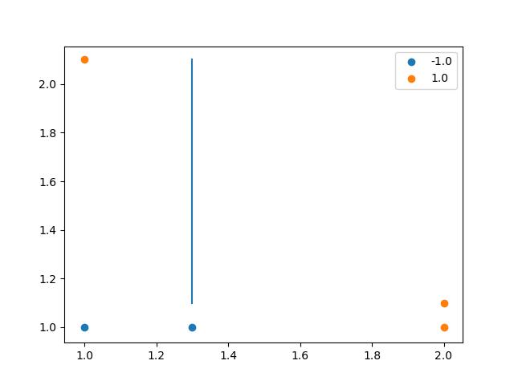
## python实现完整AdaBoost算法
  - 单层决策树不能完全分类的数据集，通过使用多棵单层决策树，构建出一个能够对该数据集完全正确分类的分类器
  ```python
  # 基于单层决策树的AdaBoost训练过程
  def adaBoostTrainDS(dataSet, labelSet, numIt = 40):
      # 保存弱分类器与其alpha值，初始化时赋一组值，否则添加新行时报错
      weakClassDf = pd.DataFrame(np.ones([1, 4]), columns=['row', 'thresh', 'inequal', 'alpha'])
      m = dataSet.shape[0]
      # 每个数据点的权重，初始值权重都相等
      D = np.ones(m) / m
      # 每个数据点的类别估计累计值
      aggpv = zeros(m)
      # 达到循环次数，或错误率为0时退出
      for i in range(numIt):
          # print('D = ', D)
          # 建立一个单层决策树
          r = buildStump(dataSet, labelSet, D)
          # print('r.pv = ', r.pv)
          # 根据分类器的错误率决定其权重值alpha
          alpha = 1 / 2 * log((1 - r.minError) / max(r.minError, 1e-16))
          r['alpha'] = alpha
          weakClassDf.ix[i] = r

          # 更新下一次迭代中的新权重向量D
          D = D * exp(-1 * r.pv * labelSet * alpha)
          D = D / D.sum()

          # 累加各分类器的结果，如果错误率为0则退出
          aggpv += alpha * r.pv
          aggError = sign(aggpv) != labelSet
          errorRate = aggError.sum() / m
          # print('errorRate = ', errorRate)
          if errorRate  == 0:
              break
      return weakClassDf
      # 用于绘制 ROC 曲线
      # return weakClassDf, aggpv

  # 测试算法
  def adaClassify(dataToClass, classifierArr):
      # 通用一维数据 / 二维数据
      data = mat(dataToClass).A
      aggpv = zeros(data.shape[0])
      for i in classifierArr.index:
          cl = classifierArr.ix[i]
          r = stumpClassify(data[:, int(cl.row)], cl.thresh, cl.inequal)
          aggpv += cl.alpha * r
          # print('arrpv = ', aggpv)
      return sign(aggpv)
  ```
  运行结果
  ```python
  rc = adaBoostTrainDS(dataSet, labelSet)
  adaClassify([0, 0], rc)
  arrpv =  [-0.69314718]
  arrpv =  [-1.24245332]
  arrpv =  [-2.04717228]
  Out[161]: array([-1.])

  d = np.arange(6).reshape(3, 2)
  adaClassify(d, rc)
  Out[163]: array([-1.,  1.,  1.])
  ```
  通过中间结果可以看到，随着迭代的进行，数据点[0,0]的分类结果越来越强
## 在一个难数据集上应用AdaBoost
  - 马疝病数据集上应用AdaBoost分类器，对比Logistic回归预测
  ```python
  # 训练数据集
  df = pd.read_table('Ch07/horseColicTraining2.txt')
  dataSet = df.iloc[:, :-1].values
  labelSet = df.iloc[:, -1].values
  # 使用10个弱分类器
  r = adaBoostTrainDS(dataSet, labelSet, 10)

  # 测试数据集
  df2 = pd.read_table('Ch07/horseColicTest2.txt')
  rc = adaClassify(df2.iloc[:, :-1].values, r)
  pd.value_counts(rc == df2.iloc[:, -1].values)
  Out[31]:
  True     51
  False    15
  dtype: int64

  # 错误率
  rr = pd.value_counts(rc == df2.iloc[:, -1].values)
  rr[False] / rr.sum()
  Out[37]: 0.22727272727272727
  ```
  在同一数据集上采用Logistic回归得到的平均错误率为0.35，而采用AdaBoost，得到的错误率会降低
## 过拟合 overfitting
  - 对于表现好的数据集，AdaBoost 会达到一个稳定的测试错误率，而并不会随分类器数目的增多而提高
  - **过拟合**，也称过学习，随着分类器数目的增多，测试错误率在达到了一个最小值之后又开始上升了，这类现象称为过拟合
  ```python
  # 参数 l：分类器的数目列表
  def errorCounts(l):
      df = pd.read_table('Ch07/horseColicTraining2.txt')
      dataSet = df.iloc[:, :-1].values
      labelSet = df.iloc[:, -1].values
      df2 = pd.read_table('Ch07/horseColicTest2.txt')
      el = []
      for i in l:
          r = adaBoostTrainDS(dataSet, labelSet, i)
          rc = adaClassify(df2.iloc[:, :-1].values, r)
          re = rc == df2.iloc[:, -1]
          rer = re.value_counts()[False] / re.count()
          el.append([i, rer])
      arr = np.array(el)
      plt.plot(arr[:, 0], arr[:, 1])
      return el

  errorCounts([1, 10, 50, 100, 500, 1000])
  Out[144]:
  [[1, 0.27272727272727271],
   [10, 0.22727272727272727],
   [50, 0.19696969696969696],
   [100, 0.21212121212121213],
   [500, 0.24242424242424243],
   [1000, 0.25757575757575757]]
  ```
  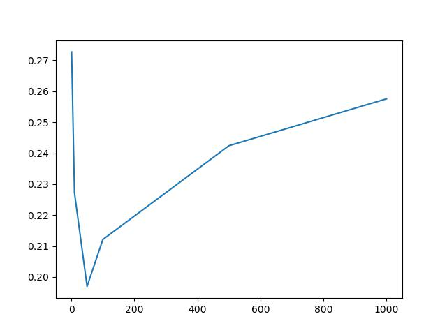
  - 可以发现使用50个分类器时，就达到了较高的性能
***

# ROC曲线 / AUC性能值 / 非均衡分类问题
## 混淆矩阵 confusion matrix
  - 错误率指的是在所有测试样例中错分的样例比例，基于错误率来衡量分类器任务的成功程度，掩盖了样例如何被分错的事实
  - 在机器学习中，混淆矩阵可以帮助人们更好地了解分类中的错误
    ```md
    | 真实结果 \ 预测结果 | 狗 | 猫 | 鼠 |
    |------------------|----|----|----|
    |        狗        | 24 | 2  | 5  |
    |        猫        | 2  | 27 | 0  |
    |        鼠        | 4  | 2  | 30 |
    ```
  - 一个好的分类器得到的结果的混淆矩阵应该是尽可能的在对角线上面”成堆的数字”，而在非对角线区域越接近0越好，意味着预测正确的要多，预测错误的要少
  - 如果混淆矩阵中的 **非对角线元素均为0**，就会得到一个近乎完美的分类器
  - 对于一个 **二分类问题**，会存在以下结果
    - **真正例 (TP)** True Positive 将一个正例正确判断成一个正例
    - **伪正例 (FP)** False Positive 将一个反例错误判断为一个正例
    - **真反例(TN)** True Negtive 将一个反例正确判断为一个反例
    - **伪反例(FN)** False Negtive 将一个正例错误判断为一个反例
  - **正确率P / 召回率R / 假阳率FPR**
    - 正确率Precision
      ```
      判断为正确的样本中，实际为正确样本的个数
      P = TP / (TP + FP)
      ```
    - 召回率 Recall / 真阳性率 True Positive Rate，TPR / 灵敏度 Sensitivity
      ```
      所有正例样本 中 预测为正且实际为正的样本 的比例
      TPR = TP / (TP + FN)
      ```
    - 假阳率 False Positice Rate，FPR 误诊率
      ```
      所有负例样本 中 预测为正但实际为负 的比例
      FPR = FP / (FP + TN)
      ```
## ROC 曲线
  - **ROC曲线** receiver operating characteristic curve 给出的是当阈值变化时假阳率和真阳率的变化情况，是反映敏感性和特异性连续变量的综合指标，ROC曲线上每个点反映着对同一信号刺激的感受性
  - **横坐标为假阳率 FPR = FP / (FP + TN)** ，如果这个值为0，意味着将所有的反例都能正确的判断出来，这个值越小越好
  - **纵坐标是真阳率 TPR = TP / (TP + FN)**，即所有的正例都能正确的判断成正例，这个值越高越好
  - ROC曲线上每个点(FPR, TPR)对应一个 **阈值**，表示的是将这个正样本排在负样本前面的概率
  - **随着阈值的逐渐减小**，越来越多的实例被划分为正类，但是这些正类中同样也掺杂着真正的负实例，即TPR和FPR会同时增大
    - 阈值最大时，TP = FP = 0，对应坐标点为 **(0, 0)**
    - 阈值最小时，TN = FN = 0，对应坐标点 **(1, 1)**
  - **理想情况下**，TPR应该接近1，FPR应该接近0，最佳的分类器应该尽可能地处于 **左上角 (0, 1)**，这就意味着分类器在假阳率FPR很低的同时，获得了很高的真阳率TPR
## AUC 性能值
  - **AUC** Area Under the Curve，对不同的ROC曲线进行比较的一个指标是曲线下的面积AUC，表示的是当前的分类算法将正样本排在负样本前面的平均概率
  - AUC给出的是 **分类器的平均性能值**，通常位于(0.5, 1)，一个完美分类器的AUC为1.0，而随机猜测的AUC则为0.5
  - **ROC曲线和AUC有个很好的特性**：当测试集中的正负样本的分布变化的时候，ROC曲线能够保持不变
## ROC曲线绘制
  - 为了画出ROC曲线，分类器必须提供 **每个样例被判为阳性或者阴性的可信程度值**，通常情况下，这些值会在最后输出离散分类标签之前被清除
    - **朴素贝叶斯** 能够提供一个可能性
    - **Logistic回归** 中输入到Sigmoid函数中的是一个数值
    - **AdaBoost和SVM**，都会计算出一个数值然后输入到sign()函数中
    - 所有的这些值都可以用于衡量给定分类器的预测强度，通常来说，可以将输出的强度范围通过某个变换映射到(0, 1)区间
  - 在一个二分类模型中，分类器给出针对每个 **实例为正类的概率**，那么通过设定一个阈值如0.6，概率大于等于0.6的为正类，小于0.6的为负类，对应的就可以算出一组(FPR, TPR)，在平面中得到对应坐标点
  - **创建ROC曲线**
    - 首先将分类样例按照其预测强度从高到低排序，依次作为阈值threshold，阈值最大时对应坐标点 (0, 0)
    - 当测试样本属于正样本的概率大于或等于这个threshold时，认为它为正样本，否则为负样本
    - 然后，将其移到排名次低的样例中去，如果该样例属于正例，那么对真阳率(TPR，纵坐标)进行修改，如果该样例属于反例，那么对假阳率(FPR，横坐标)进行修改
## python实现ROC曲线的绘制及AUC计算
  - 使用adaboostTrainDS()函数绘制ROC曲线，需要返回 **各个样本的分类预测强度**
    ```
    函数返回值替换成：
    return weakClassDf, aggpv
    ```
  ```python
  # wc指定弱分类器的数量
  def plotROC(dataSet, labelSet, wc = 10):
      _, ra = adaBoostTrainDS(dataSet, labelSet, wc)
      # 索引排序后取逆序，从大到小
      ras = ra.argsort()[::-1]

      # 设定x / y轴上移动的步长
      vc = pd.value_counts(labelSet)
      # 纵坐标 R 长度是所有实际为正的样本数量
      yStep = 1 / vc[1]
      # 横坐标 FPR 长度是所有实际为负的样本数量
      xStep = 1 / vc[-1]

      # 预测为正且实际为正的样本，在y轴上增长
      yl = np.where(labelSet[ras] == 1, yStep, 0)
      # 预测为正但实际为负的样本，在x轴上增长
      xl = np.where(labelSet[ras] == -1, xStep, 0)

      # 累计和绘制 ROC 曲线坐标
      plt.plot(xl.cumsum(), yl.cumsum())

      # 虚线表示随机分类的 ROC 曲线
      plt.plot([0,1],[0,1],'b--')
      plt.xlabel('False Positive Rate')
      plt.ylabel('True Positive Rate')
      plt.title('ROC curve for AdaBoost Horse Colic Detection System')
      plt.axis([0, 1, 0, 1])

      # 计算AUC，sum(横坐标有改变的点的纵坐标值 * 横坐标步长)
      return yl.cumsum()[xl != 0].sum() * xStep
  ```
  运行结果
  ```python
  df = pd.read_table('Ch07/horseColicTraining2.txt')
  dataSet = df.iloc[:, :-1].values
  labelSet = df.iloc[:, -1].values

  plotROC(dataSet, labelSet, 10)
  Out[217]: 0.85383895131086307

  plotROC(dataSet, labelSet, 50)
  Out[218]: 0.89676966292135007
  ```
  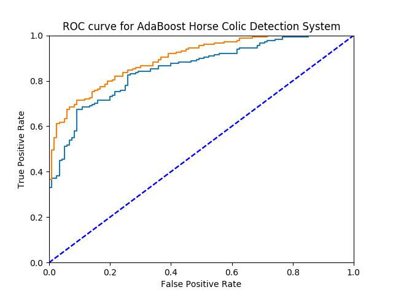
  - 50个弱分类器下得到的AUC更好
## 基于代价函数的分类器决策控制
  - **非均衡分类问题** 是指在分类器训练时正例数目和反例数目不相等（相差很大）或错分正例和反例的代价不同
  - **代价矩阵** 两种分类错误的代价是不一样的，两种正确分类所得到的收益也不一样
    ```md
    | 真实结果 \ 预测结果 | +1 | -1 |
    |------------------|----|----|
    |        +1        | -5 | 1  |
    |        -1        | 50 | 0  |
    ```
    总代价
    ```
    TP * (-5) + FN * 1 + FP * 50 + TN * 0
    ```
  - **代价敏感的学习** cost-sensitive learning，用于处理非均衡分类的代价的方法，如果在构建分类器时，知道了这些代价值，就可以在训练分类器时将错误的代价考虑在内
  - **在分类算法中引入代价信息**
    - AdaBoost中，可以基于代价函数来调整错误权重向量D
    - 朴素贝叶斯中，可以选择具有最小期望代价而不是最大概率的类别作为最后的结果
    - SVM中，可以在代价函数中对于不同的类别选择不同的参数C
## 处理非均衡问题的数据抽样方法
  - **欠抽样 undersampling 或者过抽样 oversampling** 对分类器的训练数据进行改造，调节数据集中的正例和反例数目，过抽样意味着复制样例，欠抽样意味着删除样例
  - 对于正例类别属于罕见类别的情形，应尽可能保留正例类别中的所有样例，而对反例类别进行欠抽样或者样例删除处理
    - 在确定哪些样例需要进行剔除时，可以选择那些离决策边界较远的样例进行删除
    - 一种替代的策略是，使用反例类别的欠抽样和正例类别的过抽样相混合的方法
***

# 线性回归预测数值型数据
## 普通最小二乘法线性回归 ordinary least squares, OLS
  - 回归预测连续型变量,而分类预测离散型变量
  - **线性回归方程** regression equation，将数据视为直线进行建模
    ```
    目标结果 yp = w * x
    其中的 w 称作回归系数 regression weights，求这些回归系数的过程就是回归
    回归系数是一个向量，输入也是向量，预测结果也就是求出二者的内积
    ```
  - **优点**：结果易于理解，计算上不复杂
  - **缺点**：对非线性的数据拟合不好
  - **适用数据类型**：数值型和标称型数据
  - **普通最小二乘法线性回归** 求解w一个常用的方法是使误差最小，误差是指预测 y 值和真实 y 值之间的差值，采用平方误差避免正差值和负差值相互抵消
    ```
    E(w) = Σ(i=1, N)(yi - w*xi)^2
    ```
    对w求导，并令其等于零解出w
    ```
    E'(w) = 2 * Σ(i=1, N)xi(yi - w*xi) = 0
    ==> w = (X.T * X)^(-1) * X.T * Y
    矩阵的逆可能并不存在，因此必须要在代码中对此作出判断
    ```
  - 从现有数据上估计出的w可能并不是数据中的真实w值，仅是w的一个最佳估计
## python实现普通最小二乘法线性回归
  ```python
  # 加载数据，数据的第一列是常数项1，最后一列是预测目标值
  df = pd.read_table('Ch08/ex0.txt', header=None)
  xArr, yArr = df.values[:, :-1], df.values[:, -1]

  # 标准回归函数
  def standRegres(xArr, yArr):
      xMat = np.mat(xArr)
      yMat = np.mat(yArr).T
      xx = xMat.T * xMat
      if np.linalg.det(xx) == 0:
          print('determinant is 0!')
          return  # return None

      w = xx.I * (xMat.T * yMat)
      return w.A1

  # 绘制点线图，(目标横坐标，目标纵坐标，预测值)
  def plotDotLine(x, y, yp):
      plt.scatter(x[:, 1], y, s = 10)

      xs = x[:, 1].argsort()
      plt.plot(x[xs, 1], np.array(yp)[xs], 'r')
  ```
  运行结果
  ```python
  w = standRegres(xArr, yArr)
  w # Out[280]: array([ 3.00774324,  1.69532264])
  yp = np.dot(xArr, w)
  plotDotLine(xArr, yArr, yp)
  ```
  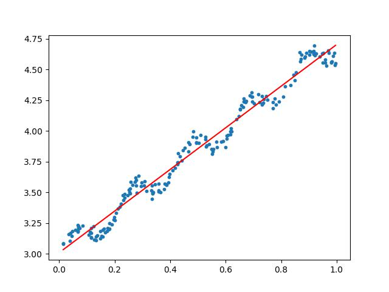
## 相关系数计算预测值和真实值的匹配程度
  - **相关系数** 计算预测值和真实值的匹配程度，通过命令corrcoef(yEstimate, yActual)来计算，结果越接近1匹配程度越高
    ```python
    yp = np.dot(xArr, w)
    corrcoef(yp, yArr)
    Out[445]:
    array([[ 1.        ,  0.98647356],
           [ 0.98647356,  1.        ]])
    ```
  - 对角线上的数据是1.0，因为 yArr 和自己的匹配是最完美的，而 yp 和 yArr 的相关系数为0.98
## 局部加权线性回归 Locally Weighted Linear Regression，LWLR
  - 最佳拟合直线方法将数据视为直线进行建模，线性回归的一个问题是有可能出现欠拟合现象，因为它求的是具有最小均方误差的无偏估计
  - **局部加权线性回归**
    - 给待预测点附近的每个点赋予一定的权重，在这个子集上基于最小均方差来进行普通的回归
    - 与kNN一样，该加权模型认为样本点距离越近，越可能符合同一个线性模型
    - 与kNN一样，这种算法每次预测均需要事先选取出对应的数据子集
  - **局部加权线性回归中的回归系数w**
    ```
    w = (X.T * W * X)^(-1) * X.T * W * Y
    其中W是一个矩阵，用来给每个数据点赋予权重
    ```
  - **LWLR使用核（与支持向量机中的核类似）来对附近的点赋予更高的权重**，核的类型可以自由选择，最常用的核就是高斯核，高斯核对应的权重如下
    ```
    W(i, i) = exp((xi - x)^2 / (-2 * k^2))
    构建了一个只含对角元素的权重矩阵w，点x与x(i)越近，w(i,i)将会越大
    需要用户指定的参数k，决定了对附近的点赋予多大的权重
    ```
## python实现局部加权线性回归函数
  ```python
  # 计算一个点对应的预测值，参数 k 控制权重衰减的速度
  def lwlr(testPoint, xArr, yArr, k = 1.0):
      dm = testPoint - xArr
      w = exp( (dm ** 2).sum(axis=1) / (-2 * k ** 2) )
      # 使用矩阵计算时可使用对角矩阵
      # we = np.eye(xArr.shape[0]) * w
      xwx = np.dot(xArr.T * w, xArr)
      if np.linalg.det(xwx) == 0:
          print('determinant is 0!')
          return
      ws = np.dot(np.linalg.inv(xwx), np.dot(xArr.T, (w * yArr)))
      return np.dot(ws, testPoint), ws

  # 为数据集中每个点调用预测函数
  def lwlrTest(testArr, xArr, yArr, k = 1.0):
      # 用于将一维数组转化为二维行数组
      testArr = mat(testArr).A
      r = []
      for i in testArr:
          t, _ = lwlr(i, xArr, yArr, k)
          r.append(t)
      return r
  ```
  运行结果
  ```python
  lwlr(xArr[0],xArr,yArr,1.0) # Out[242]: 3.1220447140568677

  fig = plt.figure(figsize=(5, 6))
  ks = [1, 0.01, 0.003]
  for i, j in enumerate(ks):
      ax = fig.add_subplot(3, 1, i+1)
      yw = lwlrTest(xArr, xArr, yArr, j)
      plotDotLine(xArr, yArr, yw)
      plt.ylabel('k = %s' %(j))  # ks中元素类型是 %s [ ??? ]
  ```
  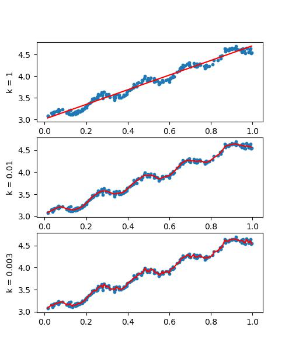
  - k = 1.0 时权重很大，如同将所有的数据视为等权重，得出的最佳拟合直线与标准的回归基本一致，属于欠拟合
  - k = 0.01 得到了非常好的效果，抓住了数据的潜在模式
  - k = 0.003 纳入了太多的噪声点，拟合的直线与数据点过于贴近，导致了过拟合现象
## 预测鲍鱼的年龄
  - 有一份来自UCI数据集合的数据，记录了鲍鱼的年龄，鲍鱼年龄可以从鲍鱼壳的层数推算得到
  ```python
  df = pd.read_table('Ch08/abalone.txt', header=None)
  abX, abY = df.values[:, :-1], df.values[:, -1]

  # 用于分析预测误差的大小, (真实值，预测值)
  rssError = lambda y, yp : ((y - yp) ** 2).sum(-1)

  # 使用较小的核将得到较低的误差，在原数据上有很好的预测效果
  # 但使用最小的核将造成过拟合，对新数据不一定能达到最好的预测效果
  yp1 = lwlrTest(abX[0:99], abX[0:99], abY[0:99], 0.1)
  yp2 = lwlrTest(abX[0:99], abX[0:99], abY[0:99], 1)
  yp3 = lwlrTest(abX[0:99], abX[0:99], abY[0:99], 10)
  rssError(abY[:99], [yp1, yp2, yp3])
  Out[196]: array([  56.83122412,  429.89056187,  549.11817088])

  # 三个参数中，核大小等于10时的测试误差最小，但它在训练集上的误差却是最大的
  ypp1 = lwlrTest(abX[100:199], abX[0:99], abY[0:99], 0.1)
  ypp2 = lwlrTest(abX[100:199], abX[0:99], abY[0:99], 1)
  ypp3 = lwlrTest(abX[100:199], abX[0:99], abY[0:99], 10)
  rssError(abY[100:199], [ypp1, ypp2, ypp3])
  Out[197]: array([ 105453.9068236 ,     573.52614419,     517.57119054])

  # 简单的线性回归预测
  ws = standRegres(abX[0:99], abY[0:99])
  ys = np.dot(abX[100:199], ws)
  rssError(abY[100:199], ys)
  Out[198]: 518.6363153249489
  ```
## 缩减系数来理解数据，岭回归 ridge regression
  - 如果特征比样本点还多（n > m），非满秩矩阵在求逆时会出现问题，不能再使用线性回归和之前的方法来做预测
  - **岭回归** 就是在矩阵 XTX 上加一个 λI 从而使得矩阵非奇异，进而能对 XTX + λI 求逆，其中
    - 矩阵 I 是一个 m×m 的单位矩阵，在0构成的平面上有一条1组成的“岭”
    - λ是一个用户定义的数值
  - 回归系数的计算公式将变成
    ```c
    w = (X.T * x + λI)^(-1) * (X.T * Y)
    ```
  - **缩减** shrinkage，岭回归最先用来处理特征数多于样本数的情况，现在也用于 **在估计中加入偏差**，从而得到更好的估计，通过引入 **λ** 来限制了所有w之和 ，通过引入该惩罚项，能够 **减少不重要的参数**，这在统计学中叫做缩减
  - 缩减方法可以去掉不重要的参数，因此能 **更好地理解数据**，与简单的线性回归相比，缩减法能取得更好的预测效果
  - **数据标准化** 使每维特征具有相同的重要性，具体的做法是所有特征都减去各自的均值并除以方差，使其分布满足0均值和单位方差
## python实现岭回归预测
  - 计算回归系数，绘制回归系数与log(λ)的关系
  ```python
  # 计算回归系数，给定lambda下的岭回归求解
  def ridgeRegres(xArr, yArr, lam=0.2):
      denom = np.dot(xArr.T, xArr) + np.eye(xArr.shape[1]) * lam
      # 如果lambda设定为0的时候可能会产生错误
      if np.linalg.det(denom) == 0:
          print('determinant is 0!')
          return
      return np.dot(np.linalg.inv(denom), np.dot(xArr.T, yArr))

  # 在一组 λ 上测试结果，以指数级变化
  def ridgeTest(xArr, yArr):
      # 数据标准化
      yArr = yArr - yArr.mean(0)
      # var方差，包含一列相同值时，var = 0计算会有问题
      xArr = (xArr - xArr.mean(0)) / xArr.var(0)
      numTestPts = 30
      ws = []
      for i in range(numTestPts):
          w = ridgeRegres(xArr, yArr, exp(i-10))
          ws.append(w.tolist())
      return np.array(ws)
  ```
  运行结果
  ```python
  df = pd.read_table('Ch08/abalone.txt', header=None)
  xArr, yArr = df.values[:, :-1], df.values[:, -1]
  ws = ridgeTest(xArr, yArr)
  plt.plot(ws)

  plt.axes([.55, 0.48, 0.35, 0.4])
  plt.plot(exp(np.arange(30)-10))
  plt.title('exp')
  ```
  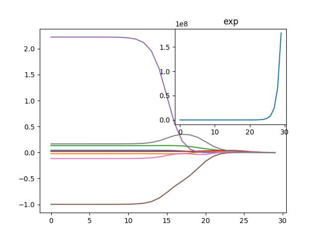
  - λ非常小时，可以得到所有系数的原始值，系数与线性回归一致
  - λ非常大时，所有回归系数缩减为0，可以在中间某处找到使得预测的结果最好的λ值
  - 为了定量地找到最佳参数值，还需要进行交叉验证
  - 通过图中特征变量对应的系数大小，还可以判断哪些变量对结果预测最具有影响力
## lasso 缩减
  - lasso least absolute shrinkage and selection operator
  - 在增加如下约束时，普通的最小二乘法回归会得到岭回归的一样的公式
    ```
    Σ(i=1, N) wi^2 <= λ
    ```
  - 限定了所有回归系数的平方和不能大于λ，使用普通的最小二乘法回归在当两个或更多的特征相关时，可能会得出一个很大的正系数和一个很大的负系数，正是因为上述限制条件的存在，使用岭回归可以避免这个问题
  - lasso也对回归系数做了限定，对应约束条件
    ```
    Σ(i=1, N) |wi| <= λ
    ```
  - 在λ足够小的时候，一些系数会因此被迫缩减到0，这个特性可以帮助我们更好地理解数据
  - 为了在这个新的约束条件下解出回归系数，需要使用二次规划算法
## 前向逐步回归
  - **前向逐步回归算法** 属于一种贪心算法，即每一步都尽可能减少误差，可以得到与lasso差不多的效果，但更加简单
  - 当应用缩减方法（如逐步线性回归或岭回归）时，模型也就增加了偏差（bias），与此同时却减小了模型的方差
  - 逐步线性回归算法的 **主要优点** 在于它可以帮助人们理解现有的模型并做出改进，当构建了一个模型后，可以运行该算法找出重要的特征，这样就有可能及时停止对那些不重要特征的收集
  - **计算过程** 一开始，所有的权重都设为1，然后每一步所做的决策是对某个权重增加或减少一个很小的值，并选取误差最小的参数调整方式
## python实现前向逐步线性回归
  ```python
  # 误差计算函数
  rssError = lambda y, yp : ((y - yp) ** 2).sum(-1)

  # eps表示每次迭代需要调整的步长，numIt表示迭代次数
  def stageWise(xArr, yArr, eps=0.01, numIt=100):
      yArr = yArr - yArr.mean(0)
      xArr = (xArr - xArr.mean(0)) / xArr.var(0)
      m = xArr.shape[1]
      # 构建每次w的调整数组，分别对应每个特征增加 /缩小 eps大小，0对应原值不改变
      wdiff = np.vstack([np.eye(m) * eps, np.eye(m) * (-eps), np.zeros(m)])
      w = np.zeros(m)
      r = []
      for i in range(numIt):
          wds = w + wdiff
          wpredict = np.dot(wds, xArr.T)
          werror = rssError(yArr, wpredict)
          # 选取误差值最小的预测值对应的调整后w值
          w = wds[werror.argmin()]
          r.append(w.tolist())
      return np.array(r)
  ```
  运行结果
  ```python
  r = stageWise(xArr, yArr, 0.005, 1000)
  df = pd.DataFrame(r)
  df.plot()
  r[-1]
  Out[42]: array([ 0.045,  0.   ,  0.105,  0.025,  1.235, -0.82 , -0.055,  0.265])

  # 与最小二乘法对比，最小二乘法得出的是误差的极小值
  yArr = yArr - yArr.mean(0)
  xArr = (xArr - xArr.mean(0)) / xArr.var(0)
  standRegres(xArr, yArr)
  Out[85]:
  array([ 0.0430442 , -0.02274163,  0.13214087,  0.02075182,  2.22403814,
         -0.99895312, -0.11725427,  0.16622915])
  ```
  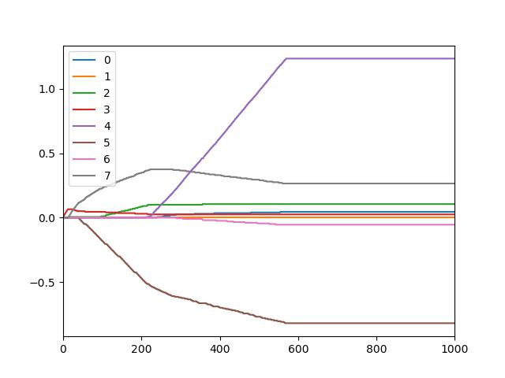
  - 结果中 w1 是0，表明它不对目标值造成任何影响，这些特征很可能是不需要的
## 权衡偏差与方差
  - 一般认为，误差由三个部分组成：**偏差、测量误差和随机噪声**
  - **偏差** 是指模型的准确性，即预测的偏差
  - **方差** 是指模型的精确度，即在随机噪声的影响下，模型间的差异程度
  - **局部加权线性回归** 通过引入越来越小的核减小训练的误差，但增大了模型的方差，也就是模型之间的差异
  - **缩减法** 可以将一些系数缩减成很小的值或直接缩减为0，减少了模型的复杂度，但同时增大了模型偏差
  - **偏差与方差折中的概念**，有助于理解现有模型并做出改进，从而得到更好的模型
  - 最小二乘法线性回归用的数据集是由函数生成的，并增加了正态分布的随机噪声
    ```python
    y = lambda x : 3 + 1.7 * x + 0.1 * np.sin(30 * x)

    x = np.random.uniform(0, 1, 200)
    xa = np.vstack([ones_like(x), x]).T
    ya = y(x) + 0.06 * np.random.normal(size=x.shape[0])

    w = standRegres(xa, ya)
    yp = np.dot(xa, w)
    plotDotLine(xa, ya, yp)

    xs = np.arange(0, 1, 0.01)
    plt.plot(xs, y(xs), 'm')
    ```
    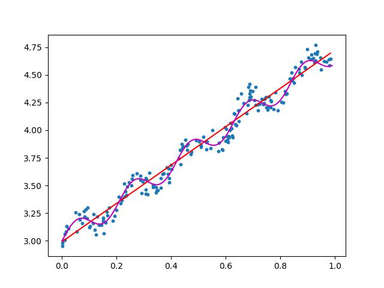
  - 直线所能得到的最佳拟合是 y = 3.0 + 1.7 * x
  - 误差部分就是 0.1 * sin(30 * x) + 0.06 * N(0, 1)
***

# 树回归
## 复杂数据的局部性建模 CART
  - 数据间的关系可能会更加复杂，如 **预测值与特征之间是非线性关系**，使用线性的模型将难以拟合
  - **CART（Classification And Regression Trees，分类回归树）的树构建算法**，将数据集切分成很多份易建模的数据，然后利用回归方法来建模，如果首次切分后仍然难以拟合就继续切分
  - **CART使用二元切分来处理连续型变量**，决策树ID3的做法是每次选取当前最佳的特征来分割数据，并按照该特征的所有可能取值来切分，二元切分法每次把数据集切成两份，如果数据的某特征值大于切分所要求的值，那么这些数据就进入树的 **右子树**，反之则进入树的 **左子树**
  - 回归树与分类树的思路类似，但叶节点的数据类型不是离散型，而是连续型
  - **回归树** 每个叶节点包含单个常数值，**模型树** 每个叶节点包含一个线性方程
## python实现回归树 regression tree
  - **回归树** 每个叶节点包含单个值，根据误差计算函数，找到数据集上所有特征向量中的最佳二元划分方式
  ```python
  # 回归树叶节点，使用所有该叶节点中特征值的平均值
  def regLeaf(df):
      return df.iloc[:, -1].mean()
  # 回归树误差计算方式，总方差 = 均方差 * 元素数量
  def regErr(df):
      return df.iloc[:, -1].var() * df.shape[0]

  # 递归构建回归树
  # leafType 建立叶节点的函数
  # errType 误差计算函数
  # ops 控制树构建的拟合程度 (划分叶节点的最小误差，叶节点包含的最小元素数)
  def createTree(dataSet, leafType=regLeaf, errType=regErr, ops=(1, 4)):
      tolS, tolN = ops
      df = pd.DataFrame(dataSet)
      # 所有特征值相同，构建叶节点
      if (df.iloc[:, -1].drop_duplicates().size == 1):
          return [None, leafType(df)]
      n = df.shape[1]
      errorOrig = errType(dataSet)
      errorMin = errorOrig
      r = []
      # 划分数据集，循环使用所有特征向量中的所有值
      for row in range(n-1):
          stamp_row = df.iloc[:, row]
          for splitVal in stamp_row.drop_duplicates():
              # 根据划分值将数据集分为两组
              grouped = df.groupby(stamp_row > splitVal)
              # 如果某个子集的元素数量小于tolN，不使用该划分方式
              if ((grouped.size() > tolN).all() == False):
                  continue
              # 计算该划分方式下的误差值
              errCount = grouped.apply(errType).fillna(0).sum()
              if errCount < errorMin:
                  r = [row, splitVal]
                  errorMin = errCount
      # 如果最佳划分后的误差减少小于tolS，创建叶节点
      if (r == []) or ((errorOrig - errorMin) < tolS):
          return [None, leafType(df)]
      # 如果没有创建叶节点，在子集上递归调用回归树创建
      grouped = df.groupby(df.iloc[:, r[0]] > r[1])
      return [r, grouped.apply(createTree, leafType, errType, ops)]
  ```
  - 二维数据上两组数据运行结果
  ```python
  df = pd.read_table('Ch09/ex00.txt', header=None)
  r = createTree(df)
  r
  Out[162]:
  ([0, 0.48813000000000001], 0
   False    [None, -0.04465028571428573]
   True        [None, 1.018096767241379]
   dtype: object)

  plt.scatter(df.values[:, 0], df.values[:, 1], s = 10)
  plt.plot([r[0][1]]*2, [-0.5, 1.5], 'r')
  plt.plot([0, 0.4], [r[1][False][1]]*2, 'y')
  plt.plot([0.5, 1.0], [r[1][True][1]]*2, 'y')
  ```
  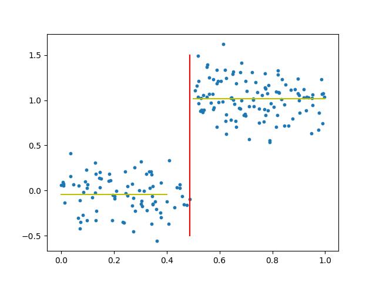
  - 二维数据上多次切分运行结果
  ```python
  df = pd.read_table('Ch09/ex0.txt', header=None)
  r = createTree(df)
  r
  Out[220]:
  [1, 0.39434999999999998], 1
  False     [1, 0.19783399999999998], 1
            False    [None, -0.02383815555555556]
            True     [None, 1.0289583666666666]
  True      [1, 0.58200200000000002], 1
            False    [None, 1.9800350714285717]
            True     [1, 0.79758300000000004], 1
                      False    [None, 2.9836209534883724]
                      True     [None, 3.9871632000000004]
                      Name: True, dtype: object  

  r[1][True][1][True]
  Out[239]:
  ([1, 0.79758300000000004], 1
   False    [None, 2.9836209534883724]
   True     [None, 3.9871632000000004]
   dtype: object)

  plt.scatter(df.values[:, 1], df.values[:, 2], s = 10)
  plt.plot([r[0][1]]*2, [-0.5, 4.5], 'r')
  plt.plot([r[1][False][0][1]]*2, [-0.5, 4.5], 'y')
  plt.plot([r[1][True][0][1]]*2, [-0.5, 4.5], 'g')
  plt.plot([r[1][True][1][True][0][1]]*2, [-0.5, 4.5], 'b')

  plt.plot([0, 0.2], [r[1][False][1][False]] * 2, 'm')
  plt.plot([0.2, 0.4], [r[1][False][1][True]] * 2, 'm')
  plt.plot([0.4, 0.6], [r[1][True][1][False]] * 2, 'm')
  plt.plot([0.6, 0.8], [r[1][True][1][True][1][False]] * 2, 'm')
  plt.plot([0.8, 1], [r[1][True][1][True][1][True]] * 2, 'm')
  ```
  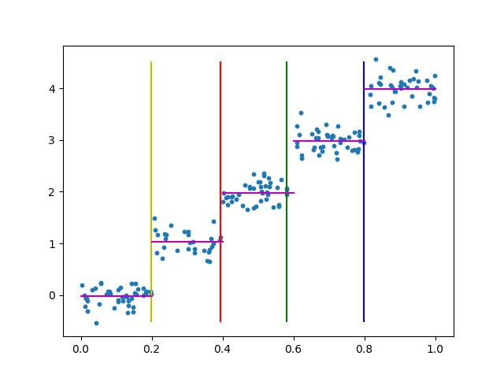
## python自定义树的一些相关方法
  - 用于判断树，寻找叶节点，左右子树，分割数据集，计算树的平均值等
    ```python
    # 判断是 树 / 叶节点
    isTree = lambda t : t[0] != None
    # 获取叶节点的值
    getLeafValue = lambda t : t[1]
    # 获取左子树
    getLeftTree = lambda t : t[1][False] if isTree(t) else getLeafValue(t)
    # 获取右子树
    getRightTree = lambda t : t[1][True] if isTree(t) else getLeafValue(t)
    # 根据 t 规定的划分方式，分割数据集 d
    treeSplitDf = lambda t, d : (d[d.iloc[:, t[0][0]] > t[0][1]], d[d.iloc[:, t[0][0]] <= t[0][1]])

    # 递归计算所有叶节点的平均值
    def getTreeMean(tree):
        if not isTree(tree):
            return getLeafValue(tree)
        else:
            lv = getTreeMean(getLeftTree(tree))
            rv = getTreeMean(getRightTree(tree))
            return (lv + rv) / 2
    ```
  - 一种回归树划分方式的图形绘制方法
    ```python
    def plotTree(tree, xRange, yRange, colorRange):
        if not isTree(tree):
            plt.plot(xRange, [tree[1]] * 2, 'm')
        else:
            plt.plot([tree[0][1]] * 2, yRange, colorRange.pop(0))
            plotTree(getLeftTree(tree), xRange, yRange, colorRange)
            plotTree(getRightTree(tree), xRange, yRange, colorRange)

    df = pd.read_table('Ch09/ex0.txt', header=None)
    r = createTree(df)
    plotTree(r, [0, 1], [-0.5, 4.5], list('rygbcmkw'))
    plt.scatter(df.values[:, 1], df.values[:, 2], s = 10)
    ```
## 树剪枝 tree pruning
  - **剪枝** 通过降低决策树的复杂度来避免过拟合的过程，CART算法构建出的树会倾向于对数据过拟合
  - **预剪枝 prepruning** 树构建算法对输入的参数 **tolS 和 tolN** 非常敏感，常常需要通过不断修改停止条件来得到合理结果
    ```
    r = createTree(df， ops=(0,1))
    构建的树将为数据集中每个样本都分配一个叶节点
    ```
  - **后剪枝 postpruning** 不需要用户指定参数，利用测试集来对树进行剪枝
    - 将数据集分成测试集和训练集
    - 指定参数，使得构建出的树足够复杂，便于剪枝
    - 接下来从上而下找到叶节点，用测试集来判断将这些叶节点合并是否能降低测试误差，如果是的话就合并
  - 预剪枝更有效，但自定义参数的合理值往往不容易找到
  - 后剪枝可能不如预剪枝有效，为了寻求最佳模型可以同时使用两种剪枝技术
## python实现回归树后剪枝 postpruning
  - 树剪枝，使用测试集进行后剪枝
  ```python
  # 树合并成叶节点
  def reduceTree(tree, value):
      tree[:] = [None, value]

  # 使用测试集进行后剪枝 (待剪枝的树，剪枝所需的测试数据)
  # 在原树上修改，不可重入
  def prune(tree, testData):
      td = pd.DataFrame(testData)
      if td.shape[0] == 0:
          print('empty testData!')
          reduceTree(tree, getTreeMean(tree))
          return None

      if isTree(tree):
          tdLeft, tdRight = treeSplitDf(tree, td)
      else:
          print('Seldom happens, unless tree empty at beginning!')
          return None

      leftTree = getLeftTree(tree)
      rightTree = getRightTree(tree)

      # 左子树 / 右子树 如果是树，递归调用剪枝
      if isTree(leftTree):
          prune(leftTree, tdLeft)
      if isTree(rightTree):
          prune(rightTree, tdRight)

      # 剪枝，树的左右分支都不是树
      if not isTree(leftTree) and not isTree(rightTree):
          # 比较，测试集上树合并后误差减小，则合并该树
          errorLeft = ((tdLeft.values[:, -1] - getLeafValue(leftTree)) ** 2).sum()
          errorRight = ((tdRight.values[:, -1] - getLeafValue(rightTree)) ** 2).sum()
          treeMean = getTreeMean(tree)
          errorMerge = ((td.values[:, -1] - treeMean) ** 2).sum()
          if (errorMerge < (errorRight + errorLeft)):
              # 修剪
              print('Merging...')
              reduceTree(tree, treeMean)
          else:
              # 不修剪
              print('Not Merging...')
      return tree
  ```
  运行结果
  ```python
  # 创建足够大的树
  df = pd.read_table('Ch09/ex2.txt', header=None)
  r = createTree(df, ops = (0, 1))

  fig = plt.figure(figsize=[5, 6])
  fig.add_subplot(2, 1, 1)
  plt.scatter(df.values[:, 0], df.values[:, 1], s = 10)
  plotTree(r, [0, 1], [-50, 150], list('rygbckmw') * 10)
  plt.title('Before pruning')

  # 修剪
  td = pd.read_table('Ch09/ex2test.txt', header=None)
  prune(r, td)

  fig.add_subplot(2, 1, 2)
  plt.scatter(df.values[:, 0], df.values[:, 1], s = 10)
  plotTree(r, [0, 1], [-50, 150], list('rygbckmw') * 10)
  plt.title('After pruning')
  ```
  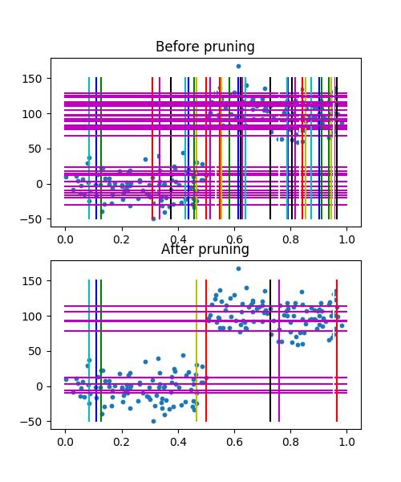
  - 大量的节点已经被剪掉，但没有像预期的那样剪枝成两部分
## python实现模型树 model tree
  - **分段线性** piecewise linear 是指模型由多个线性片段组成
  - **模型树** 每个叶节点包含一个线性方程，可使用标准线型回归方式构建
  - 只需在回归树的方法基础上，定义新的 **叶节点的模型方法** 与 **切分时的误差计算方式**，即可重用于构建模型树
  ```python
  # 使用线型回归方法，标准回归函数
  def standRegres(xArr, yArr):
      xMat = np.mat(xArr)
      yMat = np.mat(yArr).T
      xx = xMat.T * xMat
      if np.linalg.det(xx) == 0:
          print('determinant is 0!')
          return  # return None

      w = xx.I * (xMat.T * yMat)
      return w.A1

  # 用于分析预测误差的大小, (真实值，预测值)
  rssError = lambda y, yp : ((y - yp) ** 2).sum(-1)

  # x添加一列常数项
  def xyFormat(df):
      xArr = df.values[:, :-1]
      yArr = df.values[:, -1]
      xArr = np.column_stack([np.ones(xArr.shape[0]), xArr])
      return xArr, yArr

  # 叶节点模型方法
  def modelLeaf(df):
      x, y = xyFormat(df)
      return standRegres(x, y)

  # 数据切分误差计算方式
  def modelErr(df):
      x, y = xyFormat(df)
      w = standRegres(x, y)
      yp = np.dot(x, w)
      return rssError(y, yp)
  ```
  运行结果
  ```python
  df = pd.read_table('Ch09/exp2.txt', header=None)
  r = createTree(df, modelLeaf, modelErr, (1, 10))
  r
  Out[75]:
  [[0, 0.28547699999999998], 0
   False       [None, [3.46877935526, 1.18521743092]]
   True     [None, [0.00169855693608, 11.9647739443]]
   dtype: object]

  plt.scatter(df.values[:, 0], df.values[:, 1], s = 10)
  plt.plot([r[0][1]] * 2, [3, 12], 'r')
  x1 = np.array([0, r[0][1]])
  plt.plot(x1, r[1][False][1][0] * 1 + r[1][False][1][1] * x1, 'm')
  x2 = np.array([r[0][1], 1])
  plt.plot(x2, r[1][True][1][0] * 1 + r[1][True][1][1] * x2, 'm')
  ```
  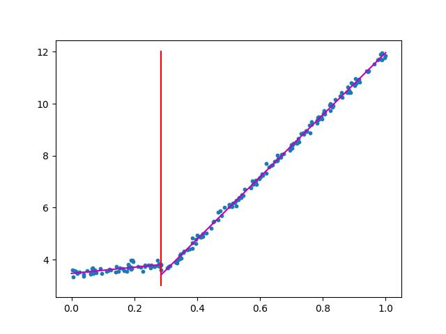
  - 该数据实际是由模型 y = 3.5 + 1.0x 和 y = 0 + 12x 再加上高斯噪声生成的
## python进行 树回归 与 标准回归 的预测结果比较
  - 函数 corrcoef 计算相关系数( R2值 )，分析模型的预测结果
  ```python
  # 叶节点上 回归树 的预测结果
  regTreeEval = lambda t, d : getLeafValue(t)
  # 叶节点上 模型树 的预测结果
  modelTreeEval = lambda t, d : np.dot(t[1][1:], d) + t[1][0]
  # 根据需要预测的数据，决定选取左子树 / 右子树
  getSubTree = lambda t, d : getRightTree(t) if d[t[0][0]] > t[0][1] else getLeftTree(t)

  # 单个数据的预测值，(构建出的树, 测试数据, 叶节点模型)
  def treeForeCast(tree, inData, modelEval=regTreeEval):
      if not isTree(tree):
          return modelEval(tree, inData)
      else:
          subTree = getSubTree(tree, inData)
          return treeForeCast(subTree, inData, modelEval)

  # 在数据集上循环测试每一项数据，(构建出的树, 测试数据集, 叶节点模型)
  def createForeCast(tree, testData, modelEval=regTreeEval):
      testData = np.mat(testData).A
      yp = []
      for td in testData:
          r = treeForeCast(tree, td, modelEval)
          yp.append(r)
      return yp
  ```
  运行结果
  ```python
  dfTrain = pd.read_table('Ch09/bikeSpeedVsIq_train.txt', header=None)
  dfTest = pd.read_table('Ch09/bikeSpeedVsIq_test.txt', header=None)

  # 回归树
  rtree = createTree(dfTrain, ops = (1, 20))
  ypr = createForeCast(rtree, dfTest.values[:, :-1])
  corrcoef(dfTest.values[:, -1], ypr)[0, 1]
  # Out[223]: 0.96408523182221373

  # 模型树
  mtree = createTree(dfTrain, modelLeaf, modelErr, ops=(1, 20))
  ypm = createForeCast(mtree, dfTest.values[:, :-1], modelEval = modelTreeEval)
  corrcoef(dfTest.values[:, -1], ypm)[0, 1]
  # Out[224]: 0.97604121913805952

  # 标准线性回归
  x, y = xyFormat(dfTrain)
  w = standRegres(x, y)
  w
  # Out[227]: array([ 37.58916794,   6.18978355])
  x, y = xyFormat(dfTest)
  yps = np.dot(x, w)
  corrcoef(y, yps)[0, 1]
  # Out[228]: 0.94346842356747562

  plt.scatter(x[:, 1], y, c='k', alpha=0.5, s = 5)
  xs = np.argsort(x[:, 1])
  plt.plot(x[xs, 1], np.array(ypr)[xs], label = 'regression tree', c = 'r')
  plt.plot(x[xs, 1], np.array(ypm)[xs], label = 'model tree', c = 'm')
  plt.plot(x[xs, 1], np.array(yps)[xs], label = 'stand regress', c = 'b')
  plt.legend(loc = 'best')
  plt.xlabel('bike speed')
  plt.ylabel('IQ')
  ```
  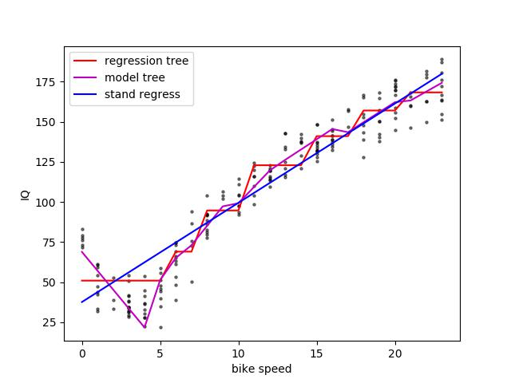
  - 从相关系数来看，该复杂数据集上模型树的结果比回归树好，树回归比简单线性模型好
***
