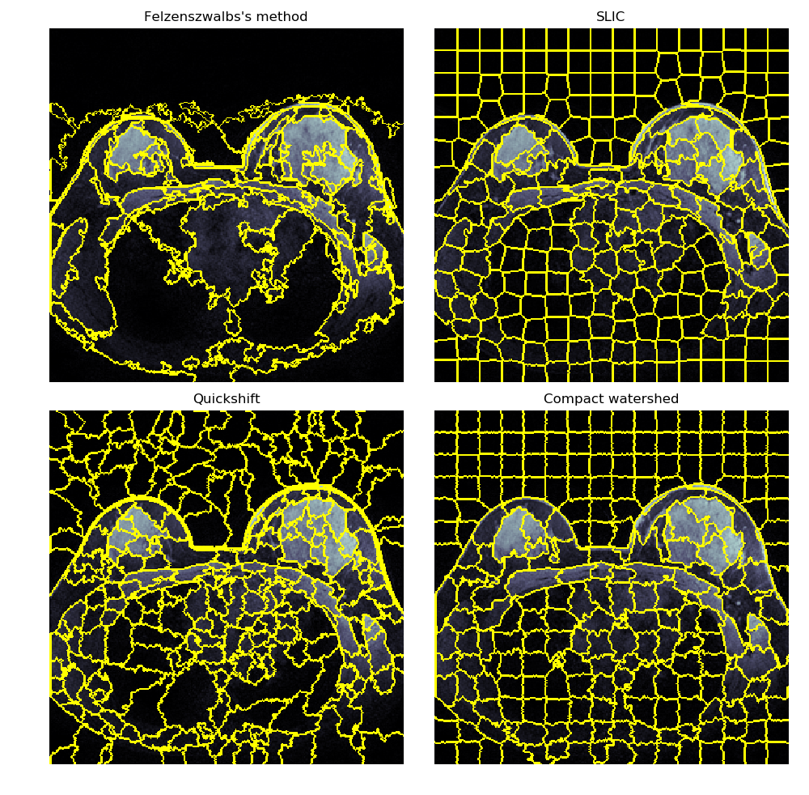
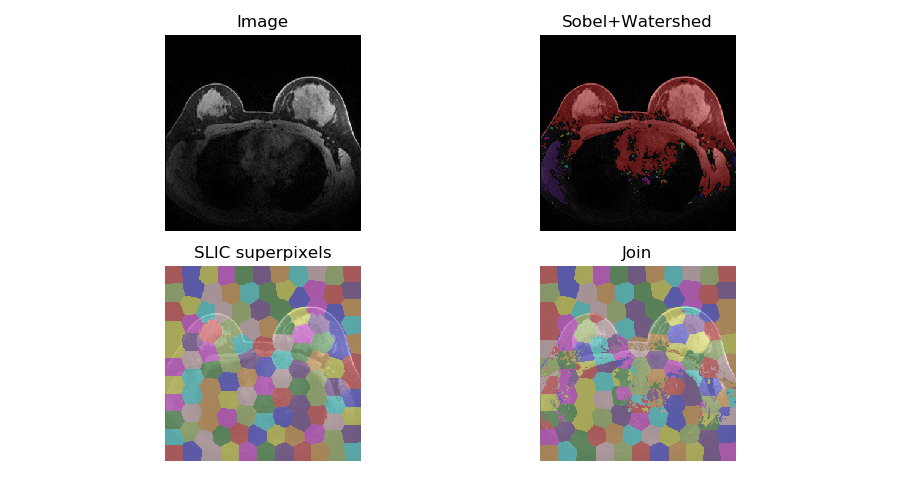
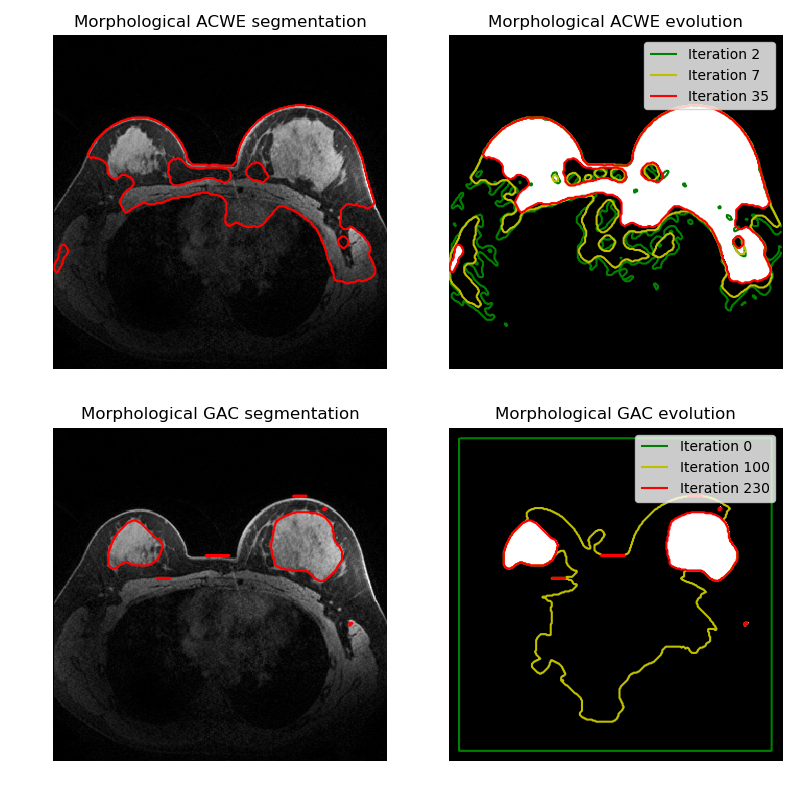

# ___2019 - 09 - 05 Dicom Segmentation___
***

# 链接
	- [图割-最大流最小切割的最直白解读](https://www.jianshu.com/p/beca253fdc9f)
	- [skimage Module: segmentation](https://scikit-image.org/docs/dev/api/skimage.segmentation.html#module-skimage.segmentation)
	- [W3cubDocs scikit_image](https://docs.w3cub.com/scikit_image/api/skimage.segmentation/#skimage.segmentation.chan_vese)
	- [Segmentation of objects](https://scikit-image.org/docs/stable/auto_examples/index.html#segmentation-of-objects)
	- [pydicom](https://github.com/pydicom/pydicom)
	- [SimpleITK Notebooks](http://insightsoftwareconsortium.github.io/SimpleITK-Notebooks/)
***

# Dicom
## 图像读取
	- **pydicom**
		```py
		import matplotlib.pyplot as plt
		import pydicom

		aa = pydicom.read_file('./IM287')
		img = aa.pixel_array
		plt.imshow(img, cmap='gray')
		plt.show()
		```
		```py
		import pydicom

		aa = pydicom.read_file('./IM287')
		bb = pydicom.read_file('./IM288')
		tt = bb.ImagePositionPatient[2] - aa.ImagePositionPatient[2]
		aa.SliceThickness = tt
		bb.SliceThickness = tt
		image = np.stack([aa.pixel_array, bb.pixel_array])
		```
## 图像颜色调整
	- **Sigmoid 调整**
		```py
		adjust_sigmoid(image, cutoff=0.5, gain=10, inv=False)
		```
	- **CLAHE (Contrast Limited Adaptive Histogram Equalization) 优化图像**
		```py
		def limitedEqualize(img_array, limit = 4.0):
				img_array_list = []
				for img in img_array:
						clahe = cv2.createCLAHE(clipLimit = limit, tileGridSize = (8,8))
						img_array_list.append(clahe.apply(img))
				img_array_limited_equalized = np.array(img_array_list)
				return img_array_limited_equalized
	  ```
## 计算差值
	```py
	import glob2
	from skimage import exposure

	imm = glob2.glob('./*.png')
	imgs = np.array([imread(ii) for ii in imm])
	iee = np.array([exposure.adjust_sigmoid(ii) for ii in imgs])

	plt.imshow(np.vstack([np.hstack(iee[5:]) - np.hstack(iee[:5])]))
	plt.tight_layout()

	plt.imshow(np.vstack([np.hstack(imgs[5:]) - np.hstack(imgs[:5])]))
	plt.tight_layout()

	itt = glob2.glob('./*.tif')
	imt = np.array([gray2rgb(resize(imread(ii), (787, 1263))) * 255 for ii in itt]).astype(uint)
	plt.imshow(np.vstack([np.hstack(iee[:5]), np.hstack(iee[5:]), np.hstack(imt)]))
	plt.tight_layout()

	plt.imshow(np.vstack([np.hstack(iee[:5]), np.hstack(iee[5:]), np.hstack(imt), np.vstack([np.hstack(imgs[5:]) - np.hstack(imgs[:5])])]))
	plt.tight_layout()
	```
## 图像分割
	- **形态学计算**
		```py
		from skimage.color import rgb2gray                                                                                                                                                                        
		from skimage.morphology import opening, binary_dilation                                                                                                                                                   
		from skimage.morphology.selem import square

		def pick_highlight(img, opening_square=50, dilation_square=100, dilation_thresh=0.05):
		    aa = rgb2gray(img)
		    bb = opening(aa, square(50))
		    cc = binary_dilation(bb > 0.05, square(100))
		    return aa * cc

		def pick_highlight(img, opening_square=50, dilation_square=180):
		    aa = rgb2gray(img)
		    bb = opening(aa, square(opening_square))
		    cc = binary_dilation(bb == bb.max(), square(dilation_square))
		    return aa * cc

		ipp = np.hstack([pick_highlight(ii) for ii in iee[5:]])
		```
	- **LOG 角点检测**
		```py
		def pick_by_blobs(img, cutoff=0.5, gain=120, min_sigma=100, max_sigma=150, num_sigma=10, threshold=.1):
		    itt = exposure.adjust_sigmoid(img, cutoff=cutoff, gain=gain)
		    image_gray = rgb2gray(itt)
		    blobs_log = blob_log(image_gray, min_sigma=min_sigma, max_sigma=max_sigma, num_sigma=num_sigma, threshold=threshold)
		    # Compute radii in the 3rd column.
		    blobs_log[:, 2] = blobs_log[:, 2] * sqrt(2)
		    return blobs_log

		def show_imgs_and_blobs(imgs, blobs):
		    rows = np.min([len(imgs), len(blobs)])
		    fig, axes = plt.subplots(1, rows, figsize=(3 * rows, 3), sharex=True, sharey=True)
		    ax = axes.ravel()

		    for id, (ii, bbs) in enumerate(zip(imgs, blobs)):
		        ax[id].imshow(ii, interpolation='nearest')
		        for bb in bbs:
		            y, x, r = bb
		            c = plt.Circle((x, y), r, color="y", linewidth=2, fill=False)
		            ax[id].add_patch(c)
		        ax[id].set_axis_off()

		blobs = [pick_by_blobs(ii) for ii in imgs[5:]]
		show_imgs_and_blobs(imgs, blobs)
		plt.tight_layout()
		```
	- **kmenas 聚类**
		```py
		from sklearn.cluster import KMeans
		km = KMeans(n_clusters=3)
		label = km.fit_predict(imgs[-1].reshape(-1, 3)).reshape([787, 1263])
		plt.imshow(np.hstack([rgb2gray(imgs[-1]), label]))
		```
## CaPTK
	- [Github CBICA/CaPTk](https://github.com/CBICA/CaPTk)
	- [Cancer Imaging Phenomics Toolkit (CaPTk)](https://cbica.github.io/CaPTk/Getting_Started.html)
	- [CBICA Image Processing Portal](https://ipp.cbica.upenn.edu/)
	```sh
	/cbica/home/IPP/wrappers-bin/libra --inputdir /cbica/home/IPP/IPP-users/626088490417991686/Experiments/512271977657680325/mammograms/ --outputdir /cbica/home/IPP/IPP-users/626088490417991686/Experiments/512271977657680325/Results/ --saveintermed 0
	```
***

# sunny_demmo
  ```py
  # MATLAB
  H = fspecial('Gaussian', [r, c], sigma);

  # opencv-python
  # cv2.getGaussianKernel(r, sigma)返回一个shape为(r, 1)的np.ndarray, fspecial里核的size的参数是先行后列, 因此:
  H = np.multiply(cv2.getGaussianKernel(r, sigma), (cv2.getGaussianKernel(c, sigma)).T)  # H.shape == (r, c)
  ```
  ```py
  图像滤波函数imfilter函数的应用及其扩展

  import cv2
  import numpy as np
  import matplotlib.pyplot as plt

  img = cv2.imread(‘flower.jpg‘,0) #直接读为灰度图像
  img1 = np.float32(img) #转化数值类型
  kernel = np.ones((5,5),np.float32)/25

  dst = cv2.filter2D(img1,-1,kernel)
  #cv2.filter2D(src,dst,kernel,auchor=(-1,-1))函数：
  #输出图像与输入图像大小相同
  #中间的数为-1，输出数值格式的相同plt.figure()
  plt.subplot(1,2,1),plt.imshow(img1,‘gray‘)#默认彩色，另一种彩色bgr
  plt.subplot(1,2,2),plt.imshow(dst,‘gray‘)
  ```
***

# DICOM 数据集
  ```py
  idd = glob2.glob('./*/*.dcm')

  for ii in idd:
      if not os.path.exists(ii + '.png'):
          ipp = pydicom.dcmread(ii).pixel_array
          if ipp.shape[0] == 512 or ipp.shape[0] == 256:
              plt.imsave(ii + '.png', ipp, cmap=pylab.cm.bone)
          else:
              for id, ijj in enumerate(ipp):
                  plt.imsave('{}_{}.png'.format(ii, id), ijj, cmap='gray')
  ```
  ```py
  idd = glob2.glob('./*')

  for ii in idd:
      if not os.path.exists(ii + '.png'):
          ipp = pydicom.dcmread(ii).pixel_array
          plt.imsave(ii + '.png', ipp, cmap=pylab.cm.bone)
  ```
***

# skimage segmentation
## Felzenszwalb Quickshift SLIC watershed
	This example compares four popular low-level image segmentation methods. As it is difficult to obtain good segmentations, and the definition of “good” often depends on the application, these methods are usually used for obtaining an oversegmentation, also known as superpixels. These superpixels then serve as a basis for more sophisticated algorithms such as conditional random fields (CRF).

	Felzenszwalb’s efficient graph based segmentation
	This fast 2D image segmentation algorithm, proposed in 1 is popular in the computer vision community. The algorithm has a single scale parameter that influences the segment size. The actual size and number of segments can vary greatly, depending on local contrast.

	1
	Efficient graph-based image segmentation, Felzenszwalb, P.F. and Huttenlocher, D.P. International Journal of Computer Vision, 2004

	Quickshift image segmentation
	Quickshift is a relatively recent 2D image segmentation algorithm, based on an approximation of kernelized mean-shift. Therefore it belongs to the family of local mode-seeking algorithms and is applied to the 5D space consisting of color information and image location 2.

	One of the benefits of quickshift is that it actually computes a hierarchical segmentation on multiple scales simultaneously.

	Quickshift has two main parameters: sigma controls the scale of the local density approximation, max_dist selects a level in the hierarchical segmentation that is produced. There is also a trade-off between distance in color-space and distance in image-space, given by ratio.

	2
	Quick shift and kernel methods for mode seeking, Vedaldi, A. and Soatto, S. European Conference on Computer Vision, 2008

	SLIC - K-Means based image segmentation
	This algorithm simply performs K-means in the 5d space of color information and image location and is therefore closely related to quickshift. As the clustering method is simpler, it is very efficient. It is essential for this algorithm to work in Lab color space to obtain good results. The algorithm quickly gained momentum and is now widely used. See 3 for details. The compactness parameter trades off color-similarity and proximity, as in the case of Quickshift, while n_segments chooses the number of centers for kmeans.

	3
	Radhakrishna Achanta, Appu Shaji, Kevin Smith, Aurelien Lucchi, Pascal Fua, and Sabine Suesstrunk, SLIC Superpixels Compared to State-of-the-art Superpixel Methods, TPAMI, May 2012.

	Compact watershed segmentation of gradient images
	Instead of taking a color image as input, watershed requires a grayscale gradient image, where bright pixels denote a boundary between regions. The algorithm views the image as a landscape, with bright pixels forming high peaks. This landscape is then flooded from the given markers, until separate flood basins meet at the peaks. Each distinct basin then forms a different image segment. 4

	As with SLIC, there is an additional compactness argument that makes it harder for markers to flood faraway pixels. This makes the watershed regions more regularly shaped. 5
  ```py
  from skimage.color import rgb2gray
  from skimage.filters import sobel
  from skimage.segmentation import felzenszwalb, slic, quickshift, watershed
  from skimage.segmentation import mark_boundaries
  from skimage.util import img_as_float
  from skimage.io import imread

  img = img_as_float(imread('./000067.dcm.png'))[:, :, :3]
  segments_fz = felzenszwalb(img, scale=100, sigma=0.5, min_size=50)
  segments_slic = slic(img, n_segments=250, compactness=10, sigma=1)
  segments_quick = quickshift(img, kernel_size=3, max_dist=6, ratio=0.5)
  gradient = sobel(rgb2gray(img))
  segments_watershed = watershed(gradient, markers=250, compactness=0.001)

  print(f"Felzenszwalb number of segments: {len(np.unique(segments_fz))}")
  print(f"SLIC number of segments: {len(np.unique(segments_slic))}")
  print(f"Quickshift number of segments: {len(np.unique(segments_quick))}")

  fig, ax = plt.subplots(2, 2, figsize=(10, 10), sharex=True, sharey=True)

  ax[0, 0].imshow(mark_boundaries(img, segments_fz))
  ax[0, 0].set_title("Felzenszwalbs's method")
  ax[0, 1].imshow(mark_boundaries(img, segments_slic))
  ax[0, 1].set_title('SLIC')
  ax[1, 0].imshow(mark_boundaries(img, segments_quick))
  ax[1, 0].set_title('Quickshift')
  ax[1, 1].imshow(mark_boundaries(img, segments_watershed))
  ax[1, 1].set_title('Compact watershed')

  for a in ax.ravel():
      a.set_axis_off()

  plt.tight_layout()
  plt.show()
  ```
  
## Join segmentations
	When segmenting an image, you may want to combine multiple alternative segmentations. The skimage.segmentation.join_segmentations() function computes the join of two segmentations, in which a pixel is placed in the same segment if and only if it is in the same segment in both segmentations.
  ```py
  import numpy as np
  import matplotlib.pyplot as plt

  from skimage.filters import sobel
  from skimage.measure import label
  from skimage.segmentation import slic, join_segmentations
  from skimage.morphology import watershed
  from skimage.color import label2rgb, rgb2gray
  from skimage.io import imread

  img = (rgb2gray(imread('./000067.dcm.png')) * 255).astype(np.uint8)

  # Make segmentation using edge-detection and watershed.
  edges = sobel(img)

  # Identify some background and foreground pixels from the intensity values.
  # These pixels are used as seeds for watershed.
  markers = np.zeros_like(img)
  foreground, background = 1, 2
  markers[img < 20] = background
  markers[img > 30] = foreground

  ws = watershed(edges, markers)
  seg1 = label(ws == foreground)

  # Make segmentation using SLIC superpixels.
  seg2 = slic(img, n_segments=117, max_iter=160, sigma=1, compactness=0.75,
              multichannel=False)

  # Combine the two.
  segj = join_segmentations(seg1, seg2)

  # Show the segmentations.
  fig, axes = plt.subplots(ncols=2, nrows=2, figsize=(9, 5),
                           sharex=True, sharey=True)
  ax = axes.ravel()
  ax[0].imshow(img, cmap='gray')
  ax[0].set_title('Image')

  color1 = label2rgb(seg1, image=img, bg_label=0)
  ax[1].imshow(color1)
  ax[1].set_title('Sobel+Watershed')

  color2 = label2rgb(seg2, image=img, image_alpha=0.5)
  ax[2].imshow(color2)
  ax[2].set_title('SLIC superpixels')

  color3 = label2rgb(segj, image=img, image_alpha=0.5)
  ax[3].imshow(color3)
  ax[3].set_title('Join')

  for a in ax:
      a.axis('off')
  fig.tight_layout()
  plt.show()
  ```
  
## Morphological Snakes
	Morphological Snakes 1 are a family of methods for image segmentation. Their behavior is similar to that of active contours (for example, Geodesic Active Contours 2 or Active Contours without Edges 3). However, Morphological Snakes use morphological operators (such as dilation or erosion) over a binary array instead of solving PDEs over a floating point array, which is the standard approach for active contours. This makes Morphological Snakes faster and numerically more stable than their traditional counterpart.

	There are two Morphological Snakes methods available in this implementation: Morphological Geodesic Active Contours (MorphGAC, implemented in the function morphological_geodesic_active_contour) and Morphological Active Contours without Edges (MorphACWE, implemented in the function morphological_chan_vese).

	MorphGAC is suitable for images with visible contours, even when these contours might be noisy, cluttered, or partially unclear. It requires, however, that the image is preprocessed to highlight the contours. This can be done using the function inverse_gaussian_gradient, although the user might want to define their own version. The quality of the MorphGAC segmentation depends greatly on this preprocessing step.

	On the contrary, MorphACWE works well when the pixel values of the inside and the outside regions of the object to segment have different averages. Unlike MorphGAC, MorphACWE does not require that the contours of the object are well defined, and it works over the original image without any preceding processing. This makes MorphACWE easier to use and tune than MorphGAC.
  ```py
  import numpy as np
  import matplotlib.pyplot as plt
  from skimage import data, img_as_float
  from skimage.io import imread
  from skimage.segmentation import (morphological_chan_vese,
                                    morphological_geodesic_active_contour,
                                    inverse_gaussian_gradient,
                                    checkerboard_level_set)


  def store_evolution_in(lst):
      """Returns a callback function to store the evolution of the level sets in
      the given list.
      """

      def _store(x):
          lst.append(np.copy(x))

      return _store


  # Morphological ACWE\
  image = rgb2gray(imread('./000067.dcm.png'))

  # Initial level set
  init_ls = checkerboard_level_set(image.shape, 6)
  # List with intermediate results for plotting the evolution
  evolution = []
  callback = store_evolution_in(evolution)
  ls = morphological_chan_vese(image, 35, init_level_set=init_ls, smoothing=3,
                               iter_callback=callback)

  fig, axes = plt.subplots(2, 2, figsize=(8, 8))
  ax = axes.flatten()

  ax[0].imshow(image, cmap="gray")
  ax[0].set_axis_off()
  ax[0].contour(ls, [0.5], colors='r')
  ax[0].set_title("Morphological ACWE segmentation", fontsize=12)

  ax[1].imshow(ls, cmap="gray")
  ax[1].set_axis_off()
  contour = ax[1].contour(evolution[2], [0.5], colors='g')
  contour.collections[0].set_label("Iteration 2")
  contour = ax[1].contour(evolution[7], [0.5], colors='y')
  contour.collections[0].set_label("Iteration 7")
  contour = ax[1].contour(evolution[-1], [0.5], colors='r')
  contour.collections[0].set_label("Iteration 35")
  ax[1].legend(loc="upper right")
  title = "Morphological ACWE evolution"
  ax[1].set_title(title, fontsize=12)


  # Morphological GAC
  gimage = inverse_gaussian_gradient(image)

  # Initial level set
  init_ls = np.zeros(image.shape, dtype=np.int8)
  init_ls[10:-10, 10:-10] = 1
  # List with intermediate results for plotting the evolution
  evolution = []
  callback = store_evolution_in(evolution)
  ls = morphological_geodesic_active_contour(gimage, 230, init_ls,
                                             smoothing=1, balloon=-1,
                                             threshold=0.69,
                                             iter_callback=callback)

  ax[2].imshow(image, cmap="gray")
  ax[2].set_axis_off()
  ax[2].contour(ls, [0.5], colors='r')
  ax[2].set_title("Morphological GAC segmentation", fontsize=12)

  ax[3].imshow(ls, cmap="gray")
  ax[3].set_axis_off()
  contour = ax[3].contour(evolution[0], [0.5], colors='g')
  contour.collections[0].set_label("Iteration 0")
  contour = ax[3].contour(evolution[100], [0.5], colors='y')
  contour.collections[0].set_label("Iteration 100")
  contour = ax[3].contour(evolution[-1], [0.5], colors='r')
  contour.collections[0].set_label("Iteration 230")
  ax[3].legend(loc="upper right")
  title = "Morphological GAC evolution"
  ax[3].set_title(title, fontsize=12)

  fig.tight_layout()
  plt.show()
  ```
  
***
